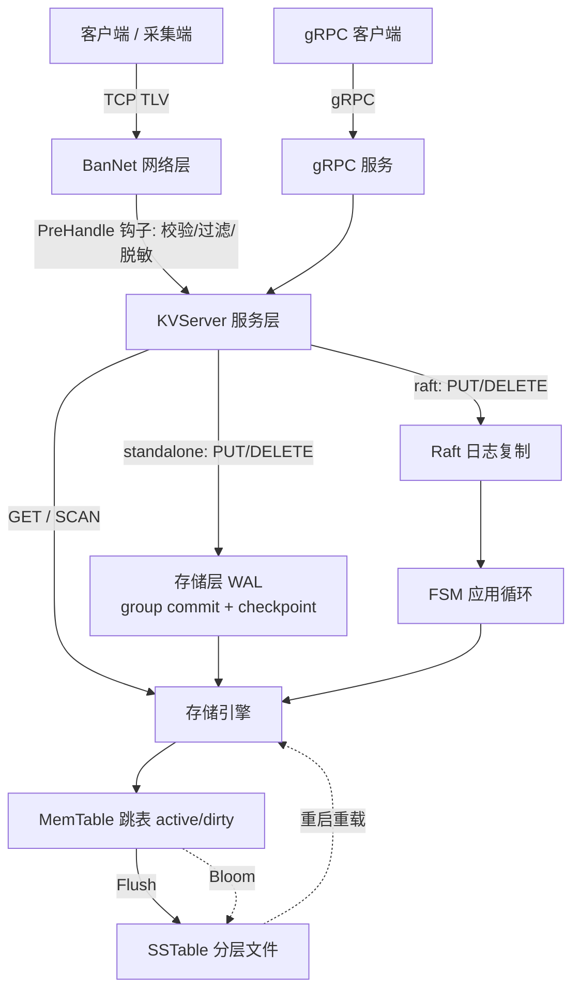

# BanDB Flux —— 具身智能 / AIoT 高性能边缘采集数据引擎

BanDB Flux 是一个用 Go 从零实现的高性能 Key-Value 数据引擎，自带**自研 TCP 框架**、**LSM 存储引擎**与**基于 Raft 的写复制**，面向**具身智能 / AIoT 的边缘高频多模态采集**而生。

它坐在传感器采集入口，做成熟栈（ROS2/DDS、rosbag2/MCAP、Zenoh）通常不做的一件事——**在数据落盘前做可编程预处理，并在边缘侧查询、只回传命中的关键切片**。

> **定位红线**：BanDB **不替代**机器人中间件，是它们之外的「采集入口可编程层」。"单二进制 / 低内存"是边缘赛道的入场券，不当作护城河来吹。

---

## 它解决什么

边缘设备（机器人机载电脑、车载、采集终端）在高频采集相机帧、IMU 等多模态数据时，硬件资源受限、网络弱而不稳。BanDB Flux 的角色是：

1. **本地优先高频落盘**：传感器只管写，LSM 引擎用内存跳表吸收瞬时高频写入，后台异步 Compaction 顺序落盘。
2. **落盘前可编程预处理**：通过 `PreHandle` 钩子在网络层、数据进系统的那一刻做校验/裁剪/脱敏/丢弃畸形帧。
3. **边缘查询 + 切片上传**（建设中）：本地按时间范围 + 谓词定位"黄金切片"，只回传命中数据，而非整段原始流。

---

## 核心能力（已实现）

- **双运行模式**：`standalone`（单机，写经存储层 WAL，不启动 Raft）与 `raft`（集群，写经 Raft 日志复制）。按配置或 Peers 数量自动推断。
- **双入口**：自研 TCP 框架 **BanNet**（二进制 TLV 协议，核心 KV 路径不依赖 HTTP/gRPC）与 **gRPC** 服务（`server_grpc`），二者共用同一 `KVServer` 服务层。
- **可编程钩子**：路由支持 `PreHandle` / `PostHandle` 回调，可用于校验、过滤、轻量 ETL。
- **LSM 存储路径**：写入进入 MemTable（跳表，active/dirty 双表），经 Bloom 过滤器加速查询，分层 Compaction 顺序落盘成 SSTable。
- **存储层 WAL + 崩溃恢复**：standalone 写先落**存储层 WAL** 再进 memtable，重启从 WAL 重放 + SSTable 重载恢复。WAL 采用 **group commit**（并发写共享一次 fsync）与**周期 checkpoint 自清洁**（重写为热数据快照，回收已落 SSTable 的历史记录，令 WAL 大小有界）。
- **Raft 写复制**：raft 模式下写命令经 Raft 日志复制后再应用到存储引擎；Raft 层自带 WAL group commit、崩溃恢复与快照。
- **写路径背压**：未刷盘字节超预算（默认 64MiB）时阻塞写入，使内存在持续高频负载下真正有界。
- **边缘范围查询**：`scan(start, end) + 谓词下推`，本地定位命中切片，只回传命中数据。
- **零依赖可观测性**：进程内原子指标 + `/metrics` Prometheus 出口（`MetricsAddr` 开关）。
- **交互式客户端**：类 Redis-CLI 的交互模式与一次性命令模式。

---

## 架构



- **入口层**：BanNet（二进制 TLV，跑钩子）或 gRPC，两条入口都汇聚到同一 `KVServer`。
- **服务层 `KVServer`**：统一 `Write`/`Get`/`Scan` 入口。standalone 直接落存储层 WAL + memtable；raft 经日志提交后由 apply 循环落盘。
- **存储层**：MemTable（跳表双表）+ 分层 SSTable。standalone 耐久性由**存储层 WAL** 提供（group commit 摊销 fsync、checkpoint 自清洁）；重启从 WAL 重放 + SSTable 重载恢复。raft 模式耐久性由 Raft WAL 提供。

---

## 快速启动

环境：Go 1.26+，Windows / Linux / macOS。

```powershell
# 启动 BanNet 服务（默认读 config/config.json，监听 127.0.0.1:8080）
cd Server
go run .

# 另开终端启动客户端
cd client
go run .
```

或启动 gRPC 服务（默认 standalone，监听 :9090）：

```powershell
go run ./server_grpc -addr localhost:9090
```

交互示例：

```text
> put imu:dev0:20260606120000 {"ax":0.01,"ay":9.8,"az":0.02}
OK
> get imu:dev0:20260606120000
"{...}"
> quit
```

---

## 协议

定长帧头的二进制协议：

```text
[dataLen: uint32] [msgID: uint32] [payload]
```

| msgID | 操作 | 负载 |
| --- | --- | --- |
| `1` | PUT | `keyLen:uint32 + valueLen:uint32 + key + value` |
| `2` | GET | `keyLen:uint32 + key` |
| `3` | DELETE | `keyLen:uint32 + key` |

响应负载首字节为状态标志（`0x00` 成功 / `0x01` 失败）；GET 成功时其后接 `valueLen:uint32 + value`。

---

## 性能：各层开销实测对比

通过 gRPC 入口对 standalone 模式做端到端压测（`grpc_benchmark`），隔离出各层的真实开销。
环境：本机 macOS/APFS，256B value、16B key、单机；单次 fsync 实测 **3.93ms**（约 254 次/秒）。

| 路径 | 并发 | QPS | P50 | 说明 |
| --- | --- | --- | --- | --- |
| **GET**（gRPC → 服务层 → memtable，纯内存） | 50 | **16,806** | 2.45ms | 读不落盘，吞吐由 CPU/网络决定 |
| **PUT** — 每写一次 fsync（改前） | 50 | 225 | 203ms | 被单机 fsync 速率（~254/s）死死封顶 |
| **PUT** — WAL group commit（改后） | 50 | **6,087** | 8ms | 并发写共享一次 fsync，**27×** |
| **PUT** — WAL group commit（改后） | 200 | **22,231** | 8ms | 并发越高摊销越充分，**~99×** |

关键结论：

- **写路径瓶颈 100% 在 fsync**：改前 PUT 的 225 qps ≈ 本机单次 fsync 上限 254/s，与 GET 的 16.8k qps 相差约 75×，差距全部来自"每写一次 fsync"。
- **group commit 让写吞吐随并发线性摊销**：后台 flusher 把当前排队的并发写攒成一批，整批只 fsync 一次，并发从 50 到 200，吞吐从 6k 涨到 22k，而持久化契约不变（`Append` 返回即已落盘）。
- **WAL 自清洁**：周期 checkpoint 把 WAL 重写为热数据快照，回收已落 SSTable 的历史记录，使 WAL 稳态大小有界（此前压测后 WAL 可涨到 11MB+ 且只增不减）。

> 复现：`go run ./server_grpc` 起服务，另开终端 `go run ./grpc_benchmark -mode put -c 200 -d 8s`（或 `-mode get`）。

---

## 压测

`benchmark/ingest/` 提供面向高频摄入的开环压测（饱和相找吞吐天花板 + 定速率相证丢帧/尾延迟/内存）。真实数据与诚实结论见 [`docs-step/M1-ingest-benchmark-result.md`](docs-step/M1-ingest-benchmark-result.md)。

```powershell
go run ./benchmark/ingest/ -sat 0 -d 60s -rates 50000,100000,200000
```

---

## 路线图

**已完成**：写路径背压（未刷盘字节超预算阻塞写入）；边缘范围查询（`scan + 谓词下推`，只回传命中切片）；standalone 存储层 WAL（group commit + checkpoint 自清洁）与崩溃恢复。

**进行中 / 计划**：
- SCAN 覆盖已落盘 SSTable 历史数据（当前仅覆盖 memtable 热数据）。
- 落盘前**真实过滤钩子**示例（丢超时/畸形帧、字段脱敏、时间戳单调校验）。
- 固定多节点边缘网关模式下，用 Raft 复制采集清单 / 断点等协调元数据。

**明确不做**（避免过度承诺）：移动设备间 Multi-Raft 强一致互备、去中心化共识调度、传感器时间同步、把对象存储已有的断点续传 + hash 校验当作自研创新。
