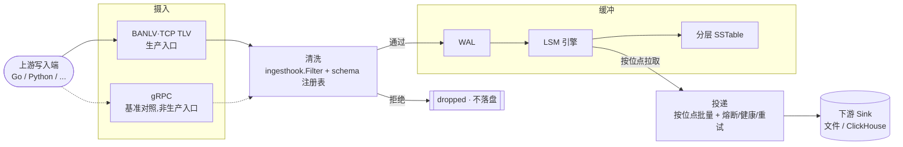

# BanDB Flux —— 数仓前置摄入缓冲 + 投递引擎

单二进制、原生协议零第三方依赖，面向数据仓库写入前置场景。

## 定位：BANLV 协议优先

BanDB 的第一身份是 **BANLV**——自研的二进制 TCP TLV 协议（6 字节定长帧头 + 变长
msgID + 负载），是生产摄入的权威入口。仓库内另有一条 gRPC 传输
（`internal/kvgrpc`），但那是基准测试/协议对照用途，不是与 BANLV 并列的生产候选。

实测支撑这个选择：写路径被 fsync 摊销后两条入口吞吐基本持平（同受物理落盘瓶颈
约束），但在不受 fsync 约束的读路径上——纯网络 + 内存查找，协议编解码开销才
显性——**BANLV 吞吐约为 gRPC 的 2.7 倍**（P50 延迟约为其 1/3）。完整数字与可
直接复现的命令见「性能」一节；协议规范见 [`docs/BANLV-协议规范.md`](docs/BANLV-协议规范.md)，
跨语言测试向量见 [`docs/banlv/vectors.json`](docs/banlv/vectors.json)（Go/Python
两侧实现共同验证的锚点）。

BanDB 坐在数据仓库（ClickHouse、Doris 等）写入入口之前：上游只管高速写，BanDB
负责吸收、清洗、缓冲，再以可控节奏投递下游。它不是数仓本体，也不替代 Kafka——
是数仓前置的**摄入缓冲 + 投递**层（与 Kafka+Spark 的对比见「设计取舍」一节）。

## 5 分钟快速开始

环境：Go 1.26+；Python 3（可选，跑 Python 客户端示例，纯标准库无需额外安装）。

**1. 起服务端**（默认读 `config/config.json`，监听 `127.0.0.1:8080`）：

```bash
cd cmd/ban-server && go run .
```

**2. Go 客户端写读**（另开终端，真实跑出）：

```console
$ go run ./cmd/ban-cli -addr 127.0.0.1:8080 put order:1001 '{"amount":128,"ts":1754380800}'
已写入: order:1001 = {"amount":128,"ts":1754380800}

$ go run ./cmd/ban-cli -addr 127.0.0.1:8080 get order:1001
{"amount":128,"ts":1754380800}
```

**3. Python 客户端写一条行情快照**（`client/python/`，不依赖 protobuf 工具链）：

```console
$ python3 client/python/examples/write_quote.py --addr 127.0.0.1:8080 \
    --code 600000 --date 2026-08-17 \
    --open 10.0 --high 10.5 --low 9.8 --close 10.2 --volume 1000000 --prev-close 10.0
写入成功: key=quote:2026-08-17:600000
读回内容: {"code": "600000", "date": "2026-08-17", "open": 10.0, "high": 10.5, "low": 9.8, "close": 10.2, "volume": 1000000.0, "prev_close": 10.0}
```

负例——非正价格被 schema 校验拒绝，脏数据不落盘（同一脚本、同一台服务端）：

```console
$ python3 client/python/examples/write_quote.py --addr 127.0.0.1:8080 \
    --code 600001 --date 2026-08-17 --open -1 --high 10.5 --low 9.8 --close 10.2 --volume 1000000
写入被拒绝（清洗/schema 校验未通过）: dropped
```

## 数据清洗：脏数据不进缓冲

落盘前的清洗钩子挂在 `service/ingesthook.Filter` 上，做三层校验，任一层不过
直接丢弃、返回 `dropped`，不落盘：

1. **帧完整性**：畸形负载（声明的 key/value 长度与实际字节数不符）、value 超限。
2. **时间戳单调性**（可选）：按设备/来源丢弃回退/重放帧。
3. **按数据类型分派的 schema 校验**（`service/ingesthook/schema/`）：注册表按
   key 前缀最长匹配分派到对应 `Validator`，无匹配前缀的类型不受影响。

以行情快照校验器 `QuoteSnapshot`（前缀 `quote:`）为例：必填字段
`code/date/open/high/low/close/volume`；价格字段（`open/high/low/close`）必须
`>0`、`volume` 必须 `>=0`；OHLC 逻辑一致（`low<=open<=high` 且 `low<=close<=high`）；
涨跌幅物理极限 ±20%（用可选字段 `prev_close` 与 `close` 比对，缺 `prev_close`
时跳过该项检查并计数，不算失败——首个交易日/复牌首日没有可比昨收）。

新增一种数据类型只需实现 `Validator` 接口并按前缀注册，不改动 `Filter` 本体。
BANLV 与 gRPC 两个入口复用同一套 `Filter.Validate`，清洗规则不会分叉——见
`client/python/crosslang_test.go` 的跨语言/跨传输一致性断言。

## 架构：摄入 → 清洗 → 缓冲 → 投递



- **摄入**：BANLV 是生产入口；gRPC 是基准测试/协议对照，见 `internal/kvgrpc` 包注释。
- **清洗**：见上一节，落盘前完成，脏数据不进缓冲。
- **缓冲**：WAL 先落盘保证不丢，LSM 引擎分层管理热/冷数据，重启自动恢复。
- **投递**：按位点批量取数，经熔断/健康/重试治理后投递下游；当前落地的 sink
  是本地文件，ClickHouse sink 待分析仓实例就位后接入。

### experimental 子系统（诚实说明）

以下两个子系统**完整实现、测试齐全，但默认不参与编译**（`//go:build experimental`），
需要 `go build -tags experimental ./...` 才会构建。不物理删除：都有完整测试，是
分布式系统设计能力的具体体现，未来需求出现时是现成起点。

| 子系统 | 是什么 | 触发条件 | 覆盖率 |
| --- | --- | --- | --- |
| `service/shardkv` | Multi-Raft 分片 KV（v1），真分片 + 多副本 | 单机吞吐远超当前量化负载，暂无横向扩展需求 | 76.9% |
| `service/delivery/governance` | 借鉴 dubbo-go 治理模型的投递治理层（熔断/健康路由/重试） | 需治理**多个**下游 sink 才有意义，当前只单一 FileSink | 66.3% |

## 首个生产租户：QuantScout

QuantScout（Python 全市场行情爬虫）是 BanDB 承接的第一个真实量化数据流：每日
收盘后全市场股票日线快照（起步 5,241 行/天，规划中的分钟级快照可能到百万行/天）。

```
QuantScout(Python) --BANLV--> BanDB(schema 校验 quote:) --LSM 缓冲--> 待投递 ClickHouse
```

落地：`client/python/bandb_client.py`（写入 SDK）+
`service/ingesthook/schema/quote.go`（校验规则）+ `quote:<日期>:<代码>` 的 key
布局（日期在前，令每日全量快照在 key 空间连续，无需改动投递/retention 机制）。

## 设计取舍：为什么不是 Kafka + Spark

传统数仓清洗是 `Source → Kafka（全量落盘）→ Spark 拉回反序列化清洗 → 数仓`，
跨两套重型分布式系统、多次网络跳转与序列化往返；BanDB 把这段收敛进一个零依赖
引擎：写入的一刻就地清洗（脏数据不进缓冲），少一套系统、少一跳、无攒批延迟，
单二进制、内存有界，不需要 Kafka/Spark 集群与 JVM。

适用区间是**中小规模 / 边缘 / 低延迟**。大规模复杂有状态流处理（跨流 join、
窗口聚合）与多消费者回放仍是 Kafka+Spark 的主场，BanDB 不做替代。

## 性能（可复现的压测数字）

环境：本机 macOS，单机，standalone 模式（无 Raft），16B key / 256B value，50 并发。

### BANLV 官方基准（`scripts/bench.sh`）

```bash
bash scripts/bench.sh -mode put -c 50 -d 10s   # 写
bash scripts/bench.sh -mode get -c 50 -d 10s   # 读（20 万 key 工作集）
```

| 操作 | QPS | P50 | P99 |
| --- | --- | --- | --- |
| GET（读，工作集 20 万 key，下穿 SSTable） | 130,000 – 187,000 | 195µs – 270µs | ~2ms |
| GET（读，工作集常驻内存表） | 116,513 | 248µs | 3.86ms |
| PUT（写，返回即已 fsync 持久化） | 6,415 | 7.66ms | 14.87ms |

### BANLV vs gRPC：同配置直接对比

两条入口最终都调用同一个 `kv.Write`，写路径被 fsync 摊销后的物理上限一致，
**PUT 吞吐两者基本持平**（本机实测 c=50：BANLV 5,247 qps / gRPC 5,594 qps，
差距落在下方所述的运行间波动范围内）。真正拉开差距的是**不受 fsync 约束的
读路径**：

| 操作（c=50） | BANLV QPS | gRPC QPS | 倍数 |
| --- | --- | --- | --- |
| GET，试验一 | 163,209 | 60,084 | 2.72× |
| GET，试验二 | 203,595 | 74,706 | 2.73× |

复现（各自独立配置/端口/数据目录，仅改 `Port`/`WALPath`/`SSTablePath`，其余
沿用仓库 `config/config.json`）：

```bash
go build -o /tmp/ban-server ./cmd/ban-server && go build -o /tmp/ban-grpc-server ./cmd/ban-grpc-server
go build -o /tmp/ban-bench  ./cmd/ban-bench  && go build -o /tmp/ban-bench-grpc  ./cmd/ban-bench-grpc
# 分别起两个服务端后，对各自地址跑：
/tmp/ban-bench      -addr 127.0.0.1:<port1> -mode get -c 50 -d 8s -n 10000 -ks 16 -vs 256
/tmp/ban-bench-grpc -addr 127.0.0.1:<port2> -mode get -c 50 -d 8s -n 10000 -ks 16 -vs 256
```

- **读路径不受文件大小与条目数影响**：布隆过滤器否决 → 块索引二分 → 单次读取
  目标块；**写吞吐由 fsync 决定**（本机 `F_FULLFSYNC` 单次约 3.94ms），与入口
  协议无关，group commit 把并发写摊销为一次 fsync。
- **同一份代码运行间波动约 ±16%**（本机热节流），压测客户端与服务端同机共享
  8 核（同机端到端口径，独立部署应更快）：评估改动需交替 A/B 测量。
- `MaxConn` 默认 100：100 并发以上压测需同步调高该配置。

## Go SDK

在自己的程序里接入用 `client` 包（并发安全，应作为长生命周期对象复用）：

```go
import "github.com/NeverENG/BanDB/client"

c, _ := client.New(client.Options{Addrs: []string{"127.0.0.1:8080"}})
defer c.Close()

_ = c.Put(ctx, []byte("order:1001"), []byte(`{"amount":128}`))
v, err := c.Get(ctx, []byte("order:1001"))
if errors.Is(err, client.ErrKeyNotFound) {
    // 「查不到」是正常结果，不是故障：SDK 不会重试它
}
```

它在演示客户端之外提供三件生产必需品：**连接池**（BANLV 严格请求-响应，并发
只能由多条连接提供）、**context**（超时/取消，含阻塞读写的强制打断）、**有界
重试**（仅对 `overloaded` 等可重试状态退避）。错误一律哨兵值判别（`errors.Is`）：
`ErrKeyNotFound`/`ErrOverloaded`/`ErrDropped`/`ErrServer`/`ErrClosed`/`ErrProtocol`。

对外契约只有三个包（`client`/`proto`/`predicate`）加 BANLV 协议规范本身——其余
实现包都在 `internal/` 下，模块外无法导入（编译器强制）。多语言接入见 `client/python/`。

## 文档地图

- [`docs/BANLV-协议规范.md`](docs/BANLV-协议规范.md) —— 帧格式/消息码/状态码/
  长度限制/连接生命周期/v1 已知限制（无版本位）与 v2 演进占位。
- [`docs/banlv/vectors.json`](docs/banlv/vectors.json) —— 跨语言测试向量，Go
  （`bannet/vectors_test.go`）与 Python（`client/python/test_bandb_client.py`）
  共同验证，防止两侧实现悄悄分叉。
- `docs/iteration-*.md` —— 按主题迭代复盘（性能排障、分片路由打通、瘦身与量化
  适配等），记录"做了什么/为什么/怎么验证"而非功能清单；上方「experimental
  子系统」一节记录 `shardkv`/`governance` 的现状与触发条件。
