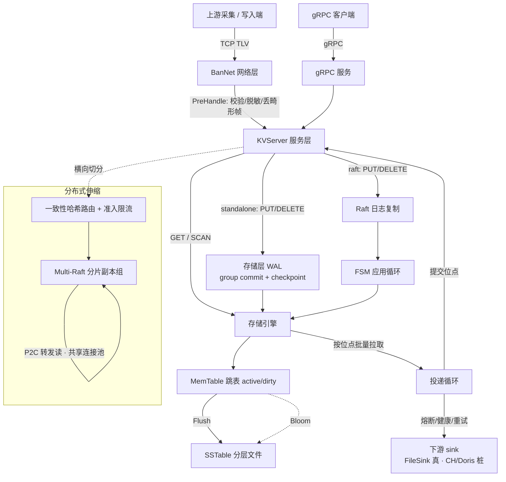

# BanDB —— 数据仓库写入前置的高性能缓冲引擎

BanDB 是一个用 Go 从零实现的高性能写入缓冲引擎，除 gRPC/Protobuf 外**零第三方依赖**——自研 TCP 框架、LSM 存储引擎、WAL 与崩溃恢复、Raft 复制、Multi-Raft 分片，全部手写。

它坐在**数据仓库的写入入口之前**，承担成熟数仓（ClickHouse、Doris 等）不擅长的那一段：**用 LSM 吸收上游的突发高频写入，在落盘前做可编程预处理，再以可靠的节奏、恰好一次地投递到下游数仓**。上游只管高速写，BanDB 负责把无序、突发、易失的写入流，整形成下游能稳定消费的数据。

> **定位红线**：BanDB **不是**数仓本体，也不替代 Kafka——它是数仓前置的**摄入缓冲 + 投递治理**层。"单二进制、零依赖、内存有界"是这条赛道的入场券，不当作护城河来吹；能被诚实量化的部分（写吞吐、连接池、副本读均衡）才是重点。

---

## 它解决什么

数仓的写入端往往面对三个矛盾：上游写入**突发且高频**，而数仓批量导入**偏好平稳**；数据在入库前**需要清洗**（畸形帧、脱敏、去重），而在数仓里做代价高；投递到下游要**不丢不重**，而网络与下游都会抖动。BanDB 把这三件事收在数仓之前：

1. **高频写入吸收**：LSM 引擎用内存跳表吸收瞬时高频写入，后台异步 Compaction 顺序落盘；WAL 提供崩溃恢复，写路径背压令内存在持续高负载下真正有界。
2. **落盘前可编程预处理**：`PreHandle` 钩子在数据进系统的那一刻做校验/裁剪/脱敏/丢弃畸形帧——脏数据不进缓冲，也不进数仓。
3. **可靠投递治理**：投递循环按已提交位点批量拉取、投递到下游 sink、成功后才推进位点；配熔断器、健康探测、退避重试；下游 sink 幂等时达成**恰好一次**。
4. **分布式横向伸缩**：数据量超单机时，按分片切分到多节点，每分片一个 Raft 组多副本复制；读经延迟感知的负载均衡在副本间择优。

---

## 核心能力

### 摄入与存储
- **LSM 存储路径**：写入进 MemTable（跳表，active/dirty 双表），Bloom 过滤器加速查询，分层 Compaction 顺序落盘为 SSTable。
- **存储层 WAL + 崩溃恢复**：standalone 写先落 WAL 再进 memtable，重启从 WAL 重放 + SSTable 重载恢复。WAL 采用 **group commit**（并发写共享一次 fsync）与**周期 checkpoint 自清洁**（重写为热数据快照、回收已落盘历史，令 WAL 大小有界）。
- **写路径背压**：未刷盘字节超预算（默认 64MiB）时阻塞写入，令内存在持续高频负载下有界。
- **可编程钩子**：`PreHandle` / `PostHandle` 回调，用于校验、过滤、脱敏、轻量 ETL（示例见 `ingesthook/`）。

### 可靠投递治理
- **投递循环**：按已提交位点批量拉取 → 投递 sink → 成功后提交位点；失败不推进位点、自然重投（默认至少一次）。
- **恰好一次**：幂等 sink 以高水位线（HWM）去重——过滤 `key <= HWM`、写新记录、原子推进 HWM，崩溃安全；配强一致位点（raft 模式位点经 Raft 日志提交）即达成端到端恰好一次。
- **治理组件**：三态熔断器（closed/open/half-open）、周期健康探测、退避重试、健康感知的多 sink 路由。
- **落地 sink**：本地 JSONL FileSink 为真实现；ClickHouse / Doris sink 为接口桩（标注未接入、探测置不健康，不会误路由）。

### 分布式横向伸缩
- **Multi-Raft 真分片**：按副本因子 `rf` 用一致性哈希环把每个分片放置到 `rf` 个节点的副本子集（`rf < 节点数`即数据跨节点分区 + 每分片多副本）；每分片一个独立 Raft 组，各组独立选主/复制/提交。
- **P2C 副本读**：非副本节点的读经「Power-of-Two-Choices + 峰值 EWMA」在副本集间按延迟/在途择优转发；并发负载下自动把读摊到多副本、串行下收敛到最快副本。
- **RPC 连接池**：节点间 RPC 每对端复用一条多路复用连接（net/rpc Client 并发安全），省去每次拨号的 TCP 握手；Raft RPC 与转发读共享同一批连接。
- **自适应准入**：梯度式并发限流（Netflix 同款，`gradient = minRTT/sampleRTT`），据实测 RTT 动态调节在途上限，过载时主动 shed。
- **一致性哈希路由 + 跨节点转发**：key→属主节点的路由与存活注册表，跨节点请求经自研 TCP 框架 BanNet 转发。

### 入口与可观测
- **双运行模式**：`standalone`（单机，写经存储层 WAL）与 `raft`（集群，写经 Raft 日志复制），按配置或 Peers 数量自动推断。
- **双入口**：自研 TCP 框架 **BanNet**（二进制 TLV 协议，核心 KV 路径不依赖 HTTP/gRPC）与 **gRPC** 服务，二者共用同一 `KVServer` 服务层。
- **零依赖可观测性**：进程内原子指标 + `/metrics` Prometheus 出口（`MetricsAddr` 开关）。

---

## 架构



- **入口层**：BanNet（二进制 TLV，跑钩子）或 gRPC，两条入口汇聚到同一 `KVServer`。
- **服务层 `KVServer`**：统一 `Write`/`Get`/`Scan`。standalone 直接落存储层 WAL + memtable；raft 经日志提交后由 apply 循环落盘。
- **存储层**：MemTable（跳表双表）+ 分层 SSTable；standalone 耐久性由存储层 WAL 提供，raft 由 Raft WAL 提供。
- **投递层**：投递循环从存储按位点批量取数、经治理组件投递下游、成功后提交位点。
- **分布式层**：一致性哈希路由 + 自适应准入把请求导向 Multi-Raft 分片副本组；读经 P2C 在副本间择优、复用共享连接池转发。

---

## 性能实测

### 写路径：group commit 让 fsync 不再封顶吞吐

通过 gRPC 入口对 standalone 模式端到端压测（`grpc_benchmark`）。环境：本机 macOS/APFS，256B value、16B key、单机；单次 fsync 实测 **3.93ms**（约 254 次/秒）。

| 路径 | 并发 | QPS | P50 | 说明 |
| --- | --- | --- | --- | --- |
| **GET**（gRPC → 服务层 → memtable，纯内存） | 50 | **16,806** | 2.45ms | 读不落盘，吞吐由 CPU/网络决定 |
| **PUT** — 每写一次 fsync（改前） | 50 | 225 | 203ms | 被单机 fsync 速率（~254/s）死死封顶 |
| **PUT** — WAL group commit（改后） | 50 | **6,087** | 8ms | 并发写共享一次 fsync，**27×** |
| **PUT** — WAL group commit（改后） | 200 | **22,231** | 8ms | 并发越高摊销越充分，**~99×** |

- **写路径瓶颈 100% 在 fsync**：改前 PUT 的 225 qps ≈ 本机单次 fsync 上限，与 GET 的 16.8k 相差约 75×，差距全部来自"每写一次 fsync"。
- **group commit 让写吞吐随并发线性摊销**：后台 flusher 把排队的并发写攒成一批、整批只 fsync 一次，并发 50→200，吞吐 6k→22k，而持久化契约不变（`Append` 返回即已落盘）。

### 节点间 RPC：连接池省掉每次拨号

`Raft/rpcpool_bench_test.go`，dial-per-call vs 连接池复用：

| 场景 | ns/op | allocs/op | 相对 |
| --- | --- | --- | --- |
| DialPerCall（串行） | 133,015 | 428 | 基线 |
| Pooled（串行） | 25,365 | 16 | **5.2× 快、27× 少分配** |
| DialPerCall（并发） | 65,459 | 428 | 基线 |
| Pooled（并发） | 5,293 | 16 | **12.4× 快** |

并发下差距拉大到 12×——正是多分片 Raft 的真实场景：dial-per-call 卡在 TCP 握手上串行化，连接池在一条连接上多路复用。

### 副本读：P2C 并发下把读摊到多副本

真分片（3 节点、`rf=2`）下，非副本节点并发转发读（8 goroutine × 40），P2C 把读摊到该分片两个副本：实测 **157 / 163**，均衡；且转发读只落在副本集内、绝不落到非副本节点。串行读时则正确收敛到最快副本（延迟最优）。

> 复现：`go run ./server_grpc` 起服务，另开终端 `go run ./grpc_benchmark -mode put -c 200 -d 8s`（或 `-mode get`）；`go test ./Raft/ -run xxx -bench BenchmarkRPC -benchmem`。

---

## 快速启动

环境：Go 1.26+，Windows / Linux / macOS。

```powershell
# 启动 BanNet 服务（默认读 config/config.json，监听 127.0.0.1:8080）
cd Server
go run .

# 另开终端启动客户端
cd client
go run .
```

或启动 gRPC 服务（默认 standalone，监听 :9090）：

```powershell
go run ./server_grpc -addr localhost:9090
```

交互示例：

```text
> put order:20260805:1001 {"amount":128,"ts":1754380800}
OK
> get order:20260805:1001
"{...}"
> quit
```

---

## 协议

定长帧头的二进制协议：

```text
[dataLen: uint32] [msgID: uint32] [payload]
```

| msgID | 操作 | 负载 |
| --- | --- | --- |
| `1` | PUT | `keyLen:uint32 + valueLen:uint32 + key + value` |
| `2` | GET | `keyLen:uint32 + key` |
| `3` | DELETE | `keyLen:uint32 + key` |

响应负载首字节为状态标志（`0x00` 成功 / `0x01` 失败）；GET 成功时其后接 `valueLen:uint32 + value`。

---

## 路线图

**已完成**：LSM + 存储层 WAL（group commit + checkpoint 自清洁）与崩溃恢复；写路径背压；范围查询（`scan + 谓词下推`）；投递治理（投递循环 + 熔断/健康/重试 + 幂等 sink 恰好一次）；Multi-Raft 真分片（`rf<节点数`）+ P2C 副本读 + RPC 连接池 + 自适应准入。

**进行中 / 计划**：
- SCAN 覆盖已落盘 SSTable 历史（当前仅覆盖 memtable 热数据）。
- 线性一致读（read-index / lease）——当前副本读为最终一致。
- ClickHouse / Doris 真实 sink 接入（当前为接口桩）。

**明确不做**（避免过度承诺）：成员动态变更与分片再平衡的数据迁移（`Placement.Rebalance` 仍是桩，需专门的迁移传输通道）；把对象存储已有的断点续传/hash 校验当作自研创新；去中心化共识调度。

---

## 诚实边界

- **恰好一次**依赖 sink 幂等，位点本身只保证至少一次；二者结合才端到端恰好一次。
- **跨节点数据迁移 / 再平衡**未实现（stretch），当前分片放置在启动时确定。
- `benchmark/ingest/` 直压存储引擎、不含 WAL 与网络，故**不**测崩溃恢复；崩溃恢复由 WAL/Raft 路径另行保证。
