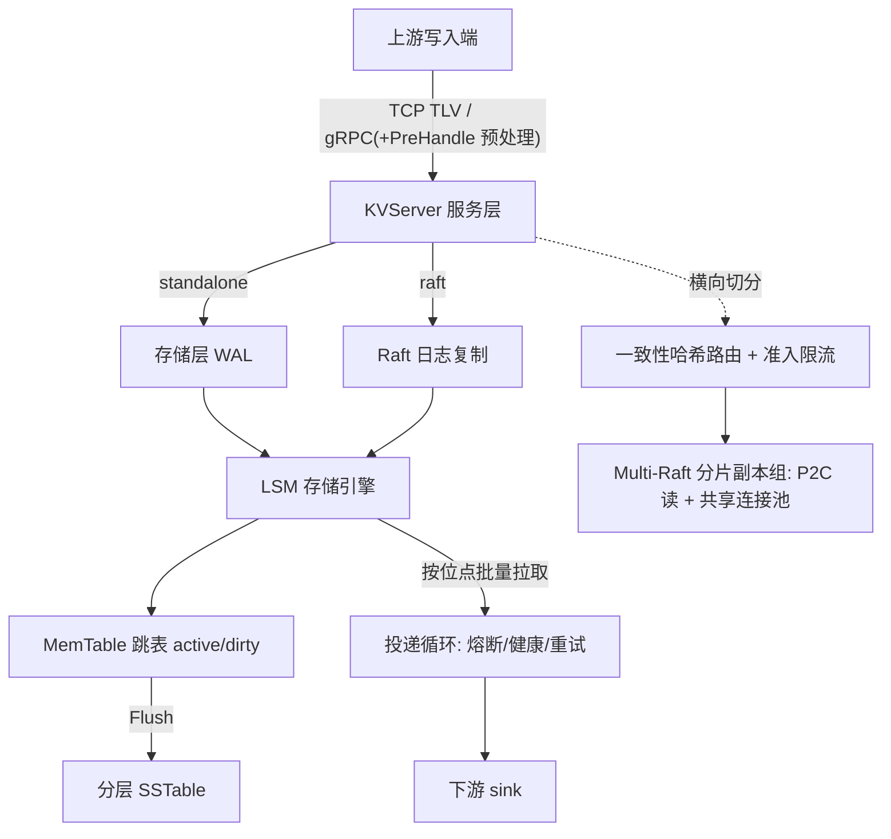

# BanDB —— 数据仓库写入前置的高性能缓冲引擎

用 Go 从零实现、除 gRPC/Protobuf 外零第三方依赖:自研 TCP 框架、LSM 存储、WAL 与崩溃恢复、Multi-Raft 分片复制全部手写。

## 定位

BanDB 坐在数据仓库（ClickHouse、Doris 等）的写入入口之前，把上游突发、高频、易失的写入流，整形成下游能平稳消费的数据。上游只管高速写，BanDB 负责吸收、清洗、缓冲，再以可控节奏投递下游。

它不是数仓本体，也不替代 Kafka——是数仓前置的**摄入缓冲 + 投递**层。

## 作用

- **吸收高频写入**：LSM 内存跳表吸收瞬时高频写，后台 Compaction 顺序落盘；WAL group commit 让并发写共享一次 fsync；写路径背压令内存有界。
- **落盘前预处理**：`PreHandle` 钩子在写入进系统的一刻做校验、脱敏、丢弃畸形帧。
- **可靠投递下游**：投递循环按已提交位点批量拉取、投递 sink、成功后才推进位点；配三态熔断、健康探测、退避重试，至少一次送达。
- **横向分片伸缩**：按副本因子把分片切到多节点，每分片一个独立 Raft 组多副本；读经 P2C 在副本间延迟感知择优转发。

## 架构



- **入口**：BanNet（二进制 TLV，无 HTTP/gRPC 依赖）或 gRPC，共用 `KVServer` 服务层。
- **存储**：MemTable 跳表双表 + Bloom 过滤器 + 分层 SSTable；standalone 耐久性由存储层 WAL 提供，raft 由 Raft 日志提供。
- **投递**：投递循环从存储按位点取数，经熔断/健康/重试治理后投递下游 sink。
- **分布式**：一致性哈希路由 + 自适应准入把请求导向 Multi-Raft 分片组；读经 P2C 复用共享连接池转发。

## 性能

环境：本机 macOS/APFS，16B key、256B value、单机；单次 fsync 实测 3.93ms。

| 路径 | 并发 | QPS | P50 |
| --- | --- | --- | --- |
| GET（纯内存） | 50 | 16,806 | 2.45ms |
| PUT（WAL group commit） | 50 | 6,087 | 8ms |
| PUT（WAL group commit） | 200 | 22,231 | 8ms |

- **写吞吐随并发摊销 fsync**：后台 flusher 把排队的并发写攒成一批、整批只 fsync 一次，持久化契约不变（`Append` 返回即已落盘）。
- **节点间 RPC 连接池**：每对端复用一条多路复用连接，较 dial-per-call 串行 5.2×、并发 12.4×。
- **副本读**：并发下 P2C 把读摊到多副本（3 节点 rf=2，两副本实测 157/163），串行下收敛到最快副本。

## 使用

环境 Go 1.26+。

```bash
# BanNet 服务（默认读 config/config.json，监听 127.0.0.1:8080）
cd Server && go run .

# 另开终端启动客户端
cd client && go run .
```

或 gRPC 服务（standalone，监听 :9090）：

```bash
go run ./server_grpc -addr localhost:9090
```

交互：

```text
> put order:1001 {"amount":128,"ts":1754380800}
OK
> get order:1001
"{...}"
> quit
```

BanNet 协议（定长帧头二进制）：

```text
[dataLen: uint32] [msgID: uint32] [payload]
```

| msgID | 操作 | 负载 |
| --- | --- | --- |
| `1` | PUT | `keyLen:uint32 + valueLen:uint32 + key + value` |
| `2` | GET | `keyLen:uint32 + key` |
| `3` | DELETE | `keyLen:uint32 + key` |

响应首字节为状态标志（`0x00` 成功 / `0x01` 失败）；GET 成功时其后接 `valueLen:uint32 + value`。
