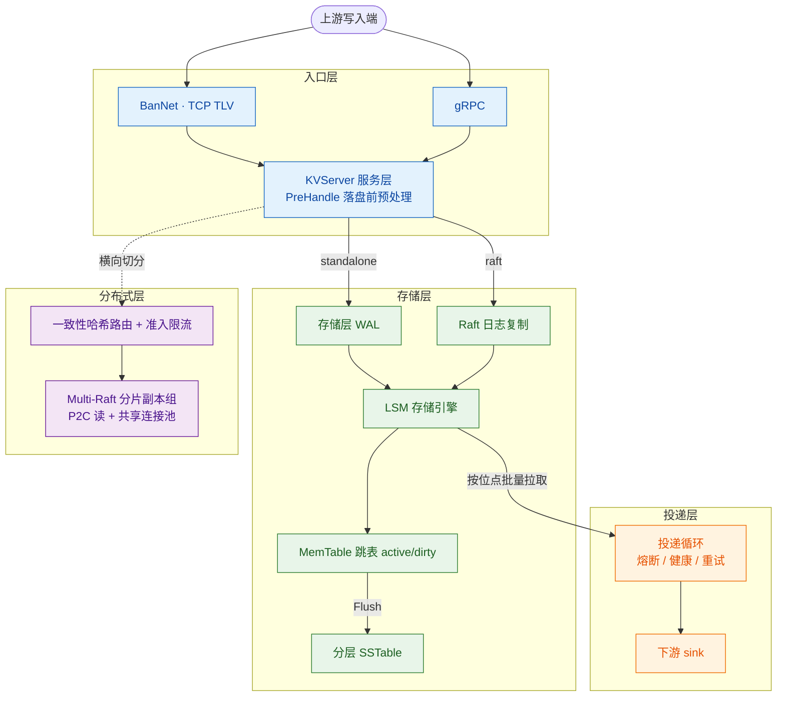

# BanDB Flux —— 高性能数仓前置存储引擎

单二进制、零第三方依赖（除 gRPC/Protobuf），开箱即用；面向数据仓库的写入前置场景。

## 定位

BanDB 坐在数据仓库（ClickHouse、Doris 等）的写入入口之前，把上游突发、高频、易失的写入流，整形成下游能平稳消费的数据。上游只管高速写，BanDB 负责吸收、清洗、缓冲，再以可控节奏投递下游。

它不是数仓本体，也不替代 Kafka——是数仓前置的**摄入缓冲 + 投递**层。

## 相比 Kafka + Spark 清洗链路

传统数仓清洗是 `Source → Kafka（原始数据全量落盘） → Spark 拉回反序列化清洗 → 数仓`，跨两套重型分布式系统、多次网络跳转与序列化往返。BanDB 把这段收敛进一个零依赖引擎：

| 维度 | Kafka + Spark | BanDB |
| --- | --- | --- |
| 清洗时机 | 原始数据先全量落 Kafka，下游再拉出来洗 | 写入进系统的一刻就地清洗，脏数据不进缓冲 |
| 数据搬运 | 写 Kafka + 拉取 + 反序列化才开始处理 | 摄入与清洗一体完成，少一套系统、少一跳、少一次序列化往返 |
| 延迟 | Spark 微批秒级批延迟 | 写入即清洗，投递紧循环，无攒批延迟 |
| 运维 | Kafka 集群 + Spark 集群 + 调度，JVM 重内存 | 单二进制、零依赖、内存有界 |

适用区间是**中小规模 / 边缘 / 低延迟**。大规模复杂有状态流处理（跨流 join、窗口聚合）与多消费者回放仍是 Kafka+Spark 的主场，BanDB 不做替代。

## 功能

- **高并发写入吸收**：突发高频写入平稳落地，内存占用有界、不会被写入打爆。
- **落盘前数据清洗**：写入进系统的一刻即校验、脱敏、丢弃畸形帧，脏数据不进缓冲。
- **崩溃恢复与断点重续**：进程崩溃重启自动恢复数据；投递从上次已提交位点续传，已投数据不重投。
- **高并发限流**：过载时自适应限流、主动拒绝多余请求，保护系统不被压垮。
- **可靠投递下游**：按位点批量投递、失败自动重试；下游故障时熔断隔离、恢复后自动探测放行，至少一次送达。
- **横向分片扩展**：数据量增大时按分片扩展到多节点，多副本容错；读请求自动在副本间择优、分摊负载。

## 架构



- **入口**：支持二进制 TCP 与 gRPC 两种接入，统一到同一服务层，落盘前跑清洗钩子。
- **存储**：写入先落盘保证不丢，内存分层管理热数据、历史数据顺序归档，重启自动恢复。
- **投递**：从缓冲按位点取数，经熔断 / 健康 / 重试治理后投递下游数仓。
- **分布式**：请求按分片路由并限流，多副本容错，读请求在副本间择优、分摊负载。

## 性能

环境：本机 macOS、单机，16B key / 256B value，50 并发，`bash scripts/bench.sh` 口径。
读取用 20 万 key 的工作集——远超单张内存表容量，故读必然下穿到 SSTable，衡量的是真实
磁盘读路径而非内存命中。

| 操作 | QPS | P50 | P99 |
| --- | --- | --- | --- |
| GET（读，工作集 20 万 key） | 130,000 – 187,000 | 195µs – 270µs | ~2ms |
| GET（读，工作集常驻内存表） | 116,513 | 248µs | 3.86ms |
| PUT（写，返回即已 fsync 持久化） | 6,415 | 7.66ms | 14.87ms |

- **读路径不受文件大小与条目数影响**：布隆过滤器否决 → 块索引二分 → 单次读取目标块，
  每次点查恒定一次 read 系统调用；命中块缓存时不触达磁盘。
- **写吞吐由 fsync 决定**：group commit 把一批并发写摊销为一次 fsync，故写吞吐随在途
  并发上升；本机 `F_FULLFSYNC` 单次约 3.94ms，即为写延迟的物理下界。
- **分布式通信高效**：节点间通信复用连接，高并发下相比每次新建连接快 5–12×。
- **读自动均衡**：并发读在副本间自动分摊（3 节点、每分片 2 副本，两副本实测 157/163）。

读取一栏给出区间而非单值，原因有三，均影响复现：

- **同一份代码的运行间波动约 ±16%**：长时间连续压测后本机热节流，实测同一二进制可从
  187,000 漂到 130,000。区间上界为冷机值，下界为持续压测后的值。也因此，评估小幅改动
  必须交替 A/B 测量——顺序测 before/after 会被漂移完全淹没。
- **压测客户端与服务端同机共享 8 核**：该数字含客户端自身开销，是「同机端到端」口径，
  不代表服务端处理上限。客户端独立部署时读吞吐应更高。
- **`MaxConn` 默认 100**：100 并发以上的压测需同步调高该配置，否则超出的连接会被拒绝。

## 使用

环境 Go 1.26+。

```bash
# BanNet 服务（默认读 config/config.json，监听 127.0.0.1:8080）
cd cmd/ban-server && go run .

# 另开终端启动客户端
cd cmd/ban-cli && go run .
```

或 gRPC 服务（standalone，监听 :9090）：

```bash
go run ./cmd/ban-grpc-server -addr localhost:9090
```

交互：

```text
> put order:1001 {"amount":128,"ts":1754380800}
OK
> get order:1001
"{...}"
> quit
```

## Go SDK

在自己的程序里接入用 `client` 包。它是并发安全的，应作为长生命周期对象复用——每次请求新建
会丢掉连接池的全部收益。

```go
import "github.com/NeverENG/BanDB/client"

c, err := client.New(client.Options{Addrs: []string{"127.0.0.1:8080"}})
if err != nil {
    return err
}
defer c.Close()

if err := c.Put(ctx, []byte("order:1001"), []byte(`{"amount":128}`)); err != nil {
    return err
}

v, err := c.Get(ctx, []byte("order:1001"))
switch {
case errors.Is(err, client.ErrKeyNotFound):
    // 「查不到」是正常结果，不是故障：SDK 不会重试它
case err != nil:
    return err
}
```

它为生产使用提供三件演示客户端没有的东西：

- **连接池**：BanNet 是严格的请求-响应协议，一条连接收到响应才能发下一帧，故并发只能由多条
  连接提供；池化同时免去每次请求的 TCP 握手。`PoolSize` 即客户端侧最大并发请求数。
- **context**：超时与取消经 `context` 传入。请求中途取消也会立即生效（阻塞的读写无法被
  context 直接打断，SDK 通过置连接 deadline 打断它）。
- **有界重试**：服务端过载时专门返回 `overloaded` 状态以示可重试，SDK 据此指数退避重试，
  次数由 `MaxRetries` 限定且受 context 截止时间约束。确定性的拒绝（键不存在、被策略丢弃）
  不重试。

错误一律为哨兵值，用 `errors.Is` 判别：`ErrKeyNotFound`、`ErrOverloaded`、`ErrDropped`、
`ErrServer`、`ErrClosed`、`ErrProtocol`。

### 对外契约只有两样

`client`（SDK）、`proto`（协议常量与编解码）、`predicate`（SCAN 谓词）三个包，加上上面的
BanNet 协议规范。这一边界由编译器强制：其余实现包都在 `internal/` 之下，模块外无法导入。

仓库内另有一条 gRPC 传输（`internal/kvgrpc`），但它**不是对外接口**，已置于 `internal/`
之下由编译器强制——模块外无法导入。把 `.proto` 交给使用方自行生成客户端，等于把内部传输
实现当成公开 API：使用方要装 protoc 工具链、要理解 protobuf，还得跟着我们的 proto 变更走。
需要多语言接入时，应当在 BanNet 协议之上提供各语言 SDK 或一个网关，而不是暴露 protobuf。

BanNet 协议：6 字节定长帧头 + 变长 msgID + 负载，多字节整数一律小端。

```text
[dataLen: uint32 LE] [msgIDLen: uint16 LE] [msgID: bytes] [data: bytes]
```

`dataLen` 只计 `data` 的长度，不含 msgID。msgID 是 ASCII 字符串而非数字：

| msgID | 操作 | data 负载 |
| --- | --- | --- |
| `PUT` | 写入 | `keyLen:uint32 LE + valueLen:uint32 LE + key + value` |
| `GET` | 读取 | `keyLen:uint32 LE + key` |
| `DEL` | 删除 | `keyLen:uint32 LE + key` |
| `SCAN` | 范围查询 | 见 `pkg/proto` 的 `EncodeScanRequest` |

响应同样是上述帧结构（msgID 为 `OK` 或 `ERR`），其 data 以状态字段开头——状态是**字符串**，
不是单字节标志：

```text
[statusLen: uint8] [status: bytes] [该操作特有的其余字节]
```

| status | 含义 | 客户端应如何处理 |
| --- | --- | --- |
| `ok` | 成功 | GET 成功时其后接 `valueLen:uint32 LE + value` |
| `notfound` | key 不存在（或已删除） | 正常查询结果，不应重试 |
| `overloaded` | 被准入控制过载拒绝 | 退避后可重试 |
| `dropped` | 被落盘前钩子按策略丢弃 | 确定性拒绝，重试无意义 |
| `error` | 服务端内部错误 | 可重试 |

客户端只应把 `ok` 视为成功；未知状态一律按失败处理，从而对将来新增的状态保持兼容。
`notfound` 与 `error` 分开正是 SDK 能提供 `ErrKeyNotFound` 的前提。

（服务端编解码见 `bannet/datapack.go`，客户端侧见 `client/conn.go`；两者的一致性由
`client/wire_compat_test.go` 逐字节交叉校验。）
