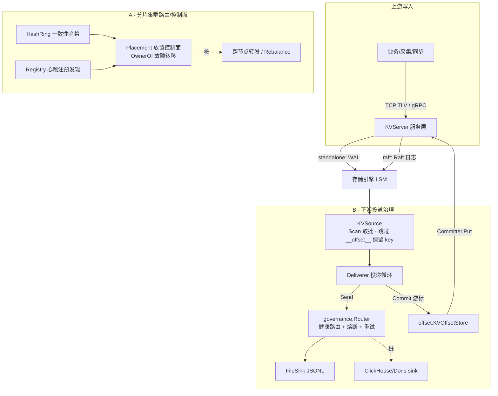

# 分布式演进骨架：下游投递治理（B）+ 分片集群路由（A）

本文档记录 BanDB 从「单机缓冲 + 可选 Raft」向「分片分布式缓冲集群」演进的**架构骨架**。

## 为什么是这个方向

起点是一个判断题：是否给 BanDB 接入类 dubbo-go 的网关治理、是否删掉自写 Raft。结论：

- **不引入 dubbo-go 框架，而是借鉴其治理模型自研**，保住项目的零第三方依赖特性。
- **治理落在数据面**，不是通用服务网格：多个下游 sink 就是要被治理的一组后端（B）；分片路由/放置控制面是 dubbo-go/PD 的数据系统类比（A）。
- **Raft 不删，给它正经岗位**：复制投递游标 offset 这类强一致小状态（见 B 的 offset 子包）。

> 交付形态是**铺广骨架 + 一条能端到端跑通的脊柱**（真 FileSink + 走 `kv.Write` 的强一致 offset + 真三态熔断器）。要拿满工程含金量，后续需在其中**一处做深**（补量化 + 故障注入 + 复盘），首选 exactly-once offset 或 sink 熔断。

## 架构



## B · 下游投递治理（`service/delivery`）

| 组件 | 文件 | 状态 |
| --- | --- | --- |
| `Sink` 接口 / `Record` / `SinkHealth` | `sink.go` | 脊柱-接口 |
| `FileSink`（JSONL + fsync） | `file_sink.go` | 脊柱-真实现 |
| ClickHouse / Doris sink | `clickhouse_sink.go` / `doris_sink.go` | 桩（标注不健康，不被路由） |
| `Deliverer` 投递循环 | `deliverer.go` | 脊柱 |
| `KVSource`（Scan 取批 + 保留 key 隔离） | `source.go` | 脊柱-真实现 |
| `OffsetStore` / `KVOffsetStore` | `offset/store.go` | 脊柱-真实现 |
| 熔断器（三态） | `governance/breaker.go` | 脊柱-真实现 |
| 健康感知路由 / 探测 / 退避重试 | `governance/{router,health,retry}.go` | 骨架 |

**强一致 offset 复用 Raft**：`offset.KVOffsetStore` 经 `offset.Committer` 抽象把游标写读路由到 `KVServer.Write`/`Get`（适配器 `service/offset_committer.go`）。raft 模式下这条写经 Raft 日志强一致复制，因此**投递游标与业务数据同享一份复制保证**，无需新增任何共识代码。

**语义边界（刻意）**：at-least-once。投递流程是「Send 成功 → Commit 游标」，Send 成功后、Commit 前崩溃会重投上一批。**exactly-once 需 sink 侧幂等**（按 `Record.Key` 去重或下游主键 upsert）兜底，offset 层不承诺。

**保留 key 隔离**：offset 以 `__offset__/<sink>` 为 key 落在同一 KV 引擎，`KVSource` 扫描时跳过 `offset.ReservedPrefix`，避免把游标自身当业务数据投递下去。

## A · 分片集群路由/控制面（`service/cluster`）

| 组件 | 文件 | 状态 |
| --- | --- | --- |
| 一致性哈希环（虚拟节点） | `routing.go` | 脊柱-真实现 |
| `ShardOf` key→shardID | `routing.go` | 真实现 |
| 心跳 TTL 注册发现 | `registry.go` | 骨架（TTL 逻辑真实） |
| 放置控制面 `OwnerOf` 故障转移 | `placement.go` | 真实现 |
| `Failover` / `Rebalance` | `placement.go` | Rebalance 为标注桩 |
| gateway 属主查询 `IsLocal` / `Forward` | `gateway.go` | 转发为标注桩 |

`Placement.OwnerOf` 经哈希环定位归属节点，若该节点在 registry 中不存活则顺环跳到下一存活节点——这是故障转移的**读侧**体现，无需数据迁移即可让路由避开死节点。

## 启用与验证

投递默认关闭（`config.G.DeliveryEnabled=false`），不影响既有写/读路径。启用后：

```jsonc
// config/config.json
{
  "DeliveryEnabled": true,
  "DeliveryFilePath": "log/delivery.jsonl",
  "DeliveryBatchSize": 100,
  "DeliveryIntervalMs": 1000
}
```

- **投递脊柱**：起服务灌数据 → `deliverer` 周期 Scan 取批写出 JSONL；kill 后重启 → 从 `offset` 已提交游标续投、不重投已提交批。
- **强一致 offset**：3 节点 raft 模式提交游标 → kill leader → 新 leader 上游标一致（复用现有 Raft）。
- **指标**：`pkg/metrics` 的 `delivered` / `delivery_failed` / `offset_commits` / `circuit_open` 随投递累加，tail 日志即可观测。
- **分片路由**：`go test ./service/cluster/...` 覆盖 key→node 稳定分布、移除节点最小迁移、心跳 TTL 判死。
- **零依赖**：`go list -m all` 依赖数不变，仍只有 grpc/protobuf。

## Stretch（明确不做 / 后续做深）

以下不在骨架内，多数涉及传输层或成员变更重写，属独立后续工作：

1. **Multi-Raft**（每分片一个 Raft 组）、**动态成员变更**、**跨节点数据转发**：现 Raft 用 Go `net/rpc` + **启动时写死、不可变的 peer 列表**，无动态成员变更；这三项是传输层 + 成员协议重写，成本最高，故列为 stretch。骨架阶段单节点 / 本地 fallback，`Forward`/`Rebalance` 留桩。
2. **exactly-once 去重**：需 sink 幂等或批边界事务，见上「语义边界」。
3. **真实数仓 connector**：ClickHouse / Doris sink 当前是桩，需接 HTTP / stream load。
4. **历史 SCAN over SSTable**：`KVSource` 当前主要覆盖 MemTable 热数据，冷数据范围投递待补。

## 已知（非本次引入）问题

- `Server/server.go` 无 `//go:build !pprof` 标签，与 `Server/server_pprof.go`（`//go:build pprof`）在 `-tags pprof` 下 `main` 重复声明。这是 origin/main 上的**既有问题**，本次骨架未修（遵循外科手术式修改，单独提出）。修复方式：给 `server.go` 加 `//go:build !pprof`。
