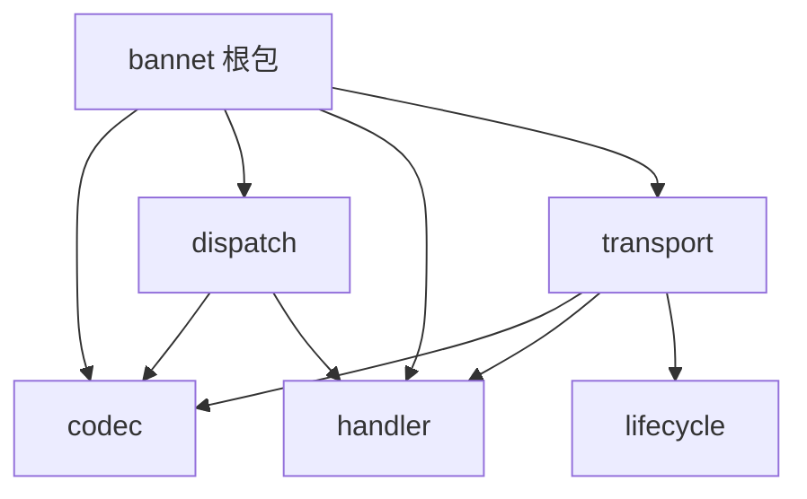

# 迭代复盘：bannet 分层重构——从隐式生命周期到显式状态机 + 五层架构

日期：2026-08-20　范围：`bannet/`（新增 `codec`/`handler`/`dispatch`/
`lifecycle`/`transport` 五个子包）

## 背景

上一轮 `recover()` 修复（`docs/iteration-2026-08-20-bannet-robustness-audit.md`）
堵住了"一个坏帧/一个业务 bug 打崩整个进程"这个最紧急的口子，是止血不是治本。
`docs/rfc/bannet-重构.md`（作者已审阅批准）在此基础上给出了治本方案：把
`bannet` 隐式的、散落在 `connection.go`/`msghandle.go`/`server.go` 三个文件里
（合计 605 行，占非测试代码 68%）的职责，重新组织成五个边界清晰、依赖方向
单向无环的子包，并把连接生命周期从裸 `context+sync.Once` 重写成显式的
`Idle→Active→Closing→Closed` 状态机。

任务定位很明确：**只做架构分层与生命周期，不碰 BANLV 协议格式**——协议 v2
是后续独立里程碑，本轮任何一步都不改变 6 字节头部的字节布局。

按 RFC 的迁移映射表（C.5）与迁移策略（C.7）严格分五步执行，一步一 commit，
不跳步、不推倒重写，每步验证 `go build`（默认与 `-tags experimental`）、
`go vet`、`go test ./...`、`go test -race ./...` 全绿，且做一次真实的
`cmd/ban-server` 启动 + PUT/GET/DELETE 冒烟。

## 五步迁移

### 第 1 步：拆 `codec` 包（commit `b932fd4`，测试补充 `6b1c09c`）

`message.go`/`datapack.go` 原样移入 `bannet/codec`。同时完成 RFC 标注的两处
"需拆分/需重写"：

- `hardMaxPackageSize`/`effectiveMaxPackageSize`（帧长上限兜底，判断"解出多大
  的帧才算合法"）从 `connection.go` 移入 `codec`，改名 `EffectiveMaxSize`。
- `connection.go` 的 `StartReader` 里手工读 `idLen`/`data`、手工比较帧长上限的
  逻辑，与 `datapack.go` 原本"只解头部"的 `UnPack` 合并成新方法
  `codec.DataPack.Decode(io.Reader, maxSize, beforeRead)`：`transport` 层从此
  只管"喂字节、拿 Message"，不再需要知道 BANLV 帧格式的任何细节。`beforeRead`
  回调保留了"每个逻辑读取单元开始前重设读超时"的原有语义。

根包用类型别名（`type Message = codec.Message` 等，非包装类型）保留
`Message`/`DataPack`/`Codec`/`NewMessage`/`NewDataPack`，外部调用方
（`cmd/ban-bench`、`client/wire_compat_test.go` 等）零改动。

**测试补充**：Step 1 提交时只靠 `bannet` 包里端到端的
`oversized_frame_test.go`/`malformed_frame_test.go` 间接验证 `Decode`，没有
直接断言过 `beforeRead` 回调的调用次数（"每个逻辑读取单元重设一次超时"这个
具体承诺）。补了 `bannet/codec/datapack_test.go`（12 个用例），用计数闭包
验证四种 msgID/负载有无组合下 `beforeRead` 分别调用 1/2/2/3 次，以及
`io.EOF`/`io.ErrUnexpectedEOF`/`ErrFrameTooLarge` 的区分、`maxSize=0` 回退到
硬上限而非"不限制"。

### 第 2 步：拆 `handler` 包（commit `bd83996`）

`interfaces.go` 里的 `Request`/`Handler`/`HookAction`、`router.go` 的
`BaseRouter` 移入 `bannet/handler`。纯接口挪位置，不涉及任何运行时行为，未
新增测试。

**偏差 1（记录在案）**：RFC 迁移表把 `Conn` 标注为迁入 `transport`（与
`ConnRegistry` 放一起）。实现时发现这会成环——`Request.Conn()` 必须返回
`Conn` 类型，而 `Request` 按同一张表要迁入 `handler`；若 `Conn` 留在
`transport`，`handler` 就要 `import transport`，但 `transport` 的
`Connection` 又需要把解出来的帧分派给 `dispatch`，与 RFC 自己在 C.4.2 强调的
"`transport` 与 `dispatch` 是兄弟关系，互相不依赖"直接冲突。把 `Conn` 和
`Request`/`Handler`/`HookAction` 放进同一个更底层的 `handler` 包，同时满足
两条约束：`transport` 依赖 `handler`（不依赖 `dispatch`），`dispatch` 依赖
`handler`（不依赖 `transport`），`transport` 与 `dispatch` 之间仍然没有任何
一条边。详见 `bannet/handler/handler.go` 顶部注释。

### 第 3 步：拆 `dispatch` 包 + 修复 bug②（commit `72a328a`）

`msghandle.go`（路由表/worker 池调度/panic 隔离）与 `request.go`（分派单元）
整体迁入 `bannet/dispatch`。

**bug②修复**：`workerPoolSize==0`（不启用 worker 池的"退化模式"）时，此前
`connection.go` 的 `StartReader` 对每一帧成功解出的请求都
`go c.MsgHandle.DoMsgHandle(req)`——每帧一个不受任何对象追踪、没有上限的
临时 goroutine，一个异常客户端能以任意速率发送合法帧逼出任意数量的一次性
goroutine。RFC C.3 的结论是不给这类 goroutine 补追踪/通知机制，而是让它不再
存在：`connection.go` 现在统一调用 `dispatch.MsgHandle.SendMsgToTaskQueue`，
`workerPoolSize==0` 时它在调用方（连接读循环）所在的 goroutine 上同步执行
`DoMsgHandle`，不新增任何 goroutine。副作用（有意，非意外）：同一连接背靠背
发来的多个请求不再可能并发/乱序执行，而是像 worker 池模式一样严格排队。

回归测试 `zero_worker_pool_dispatch_test.go` 的
`TestZeroWorkerPoolSizeDoesNotConcurrentlyDispatch` 用一个会阻塞的 Handler
直接断言"同一时刻处于 `Handle()` 中的请求数峰值恰好为 1"——比"goroutine 数
没涨"更强、不依赖 GC/调度时机。`msghandle_internal_test.go` 的
divide-by-zero 回归测试随之迁入 `bannet/dispatch/dispatch_internal_test.go`。

### 第 4 步：拆 `lifecycle` 包 + 修复 bug①（commit `61d7f32`）

把 `connection.go` 的 `ctx`/`cancel`/`stopOnce` 重写成 `bannet/lifecycle` 里
显式的四态状态机。核心设计：**`Closing` 与 `Closed` 是两个不同的广播信号**——
`Draining`（`Closing` 时关闭）只表示"决定关闭"，写路径仍然打开；`Done`
（`Closed` 时关闭）才是"物理关闭"。这个区分是修复 bug①的关键：如果两者共用
一个信号，优雅关闭会立刻掐断写路径，在途请求处理完之后产出的响应会因为连接
"已经关闭"而发不出去。

**bug①修复**（`Server.Stop()` 不等在途请求处理完，响应可能因连接已关闭而
发不出去，RFC B.2）：

- `Connection` 新增 `readerDone`/`writerDone` 信号：Reader 退出时关闭
  `readerDone`，Writer 只有观察到它之后才排空 `msgChan`/`msgBuffChan` 并
  退出；`Connection.Stop` 物理关闭 socket 前会等 `writerDone`。
- `dispatch.MsgHandle.Stop` 不再只 `close(channel)` 就返回，而是等所有
  worker 把已经排队/在途的请求真正处理完（`workerWG.Wait`，带超时兜底）。
  为避免其它仍在正常收发的连接撞上已关闭的 channel 而 panic，`taskQueues`
  不再被 `close`：改用一个只广播不发送的 `stopCh`，收到信号后的投递统一
  退化为同步执行（不静默丢弃，也不 panic）。
- `Server.Stop` 顺序：先 `MsgHandle.Stop`（等 worker 池排空）、再
  `ConnMgr.BeginClosingAll`（广播 Closing）、再 `ConnMgr.Wait`（等所有连接
  自行收尾，带宽限期）、最后 `ClearConn`（强制关闭仍未收尾的连接，兜底）。
  这个顺序是必须的：反过来会导致一个连接在它对应的 worker 还没处理完排队
  请求时就被判定"可以物理关闭"。
- `BeginClosing` 除了标记 `Closing`，还会强制 `SetReadDeadline(now)` 打断
  连接当前可能阻塞的读——一个空闲连接（没有在途请求，只是在等下一帧）如果
  不这样处理，Reader 只有在成功解出一帧之后才会检查 `Draining`，永远不会
  主动醒来。**实测数据**：不加这一步时，`TestShardRouting_MultiNode`（3 个
  节点、每节点几个长连接的集成测试）的 `Stop` 耗时从近乎瞬间涨到 30 秒；
  加上之后回落到 0.3 秒。

**回归测试的可信度验证**：`bannet/graceful_shutdown_test.go` 的
`TestGracefulStopDeliversInFlightResponse` 用一个会阻塞的 Handler 制造
"请求已分派但响应未产出"的窗口，在窗口内触发 `Server.Stop`，断言客户端最终
真的读到完整响应帧。为确认这个断言真的有区分力，手工把 `Server.Stop` 里
`MsgHandle.Stop`/`ConnMgr.BeginClosingAll` 的顺序改回错误的那种，重新跑测试
——确认失败（`decode: read header: EOF`），再改回正确顺序确认通过。这是
"反证法"验证回归测试有效性的具体记录，不是空口断言。

**四种终止诱因收敛到 `Closing`，均有测试**：

- `bannet/lifecycle/lifecycle_test.go`：状态机本身的转换规则（幂等、并发
  安全、`Draining` 与 `Done` 的区分、四种 `Event` 逐个跑一遍收敛断言）。
- `bannet/lifecycle_convergence_test.go`：EOF/超时/显式 Stop 三种诱因，用
  真实 TCP 连接 + `State()` 查询做端到端验证。
- `bannet/transport/lifecycle_panic_internal_test.go`：panic 被 recover
  这一种，直接调用 `recoverConnGoroutine`（`Start`/`StartReader`/
  `StartWriter` 共享的真实函数）——业务 Handler 的 panic 由 `dispatch` 自己
  的 `recover` 兜住不会传到这一层，人为制造一个真的会在这一层 panic 的场景
  （如 nil `*net.TCPConn`）会导致 `Stop` 的物理清理阶段再 panic 一次而不受
  任何 `recover` 保护，直接打断测试进程而非给出干净的失败，故选择直接调用
  这个共享函数作为最小验证方式。

**接口面的一处扩张**：`handler.Conn` 新增 `BeginClosing()` 方法，供
`ConnManager` 优雅关闭时批量广播使用。grep 确认外部实现方只有两处测试替身
（`service/router_reason_test.go` 的 `fakeConn`、
`bannet/dispatch/dispatch_internal_test.go` 的 `fakeConnForDivZero`），均已
补上空实现；`NewServer`/`AddRouter`/`Start`/`Stop`/`Serve` 等既有公开 API
签名不变。

### 第 5 步：拆 `transport` 包（commit `0a1a891`）

`connection.go`（剥离分发决策之后剩下的 I/O 编排）与 `conn_manager.go` 整体
迁入 `bannet/transport`。`transport.Connection` 不再持有 `dispatch.Dispatcher`
或 `*Server`，改为持有一个 `OnFrame func(msg *codec.Message, conn handler.Conn)`
回调——`StartReader` 解出一帧后调用 `c.OnFrame(msg, c)`。根包 `Server.onFrame`
是唯一的接线点：把 `transport` 解出来的 Frame 转交给 `dispatch`，这是
`transport` 与 `dispatch` 之间唯一存在的"依赖"，靠回调而不是 `import` 表达。
`ConnStartFunc`/`ConnStopFunc` 回调与原本套在外面的 `recover` 兜底也下沉成
`Connection` 自己的 `callConnStartFunc`/`callConnStopFunc` 方法。

**偏差 2（记录在案）**：RFC 迁移表把 `acceptLoop`/`Server` 也归到
`transport`。实现时发现 `Server` 是把 `transport`（监听/连接）、`dispatch`
（`MsgHandle`）、进程级信号处理三者组合在一起的编排对象——`Server.AddRouter`
转发给 `MsgHandle`、`Server.Stop` 需要按顺序驱动 `MsgHandle.Stop` 与
`ConnMgr` 的三个方法，把整个 `Server` 结构体搬进 `transport` 会让
`transport` 直接依赖 `dispatch`，正是 C.4.2 要避免的环。`Server` 保留在根包
——符合 C.4.1"根包：组合门面...内部委托给上面五个子包"的定位，只是委托的
具体形态是 `Server` 结构体本身留在根包，`acceptLoop` 作为它的方法一起留下，
但内部调用 `transport.NewConnection` 而非包内构造函数。

## 依赖图：编译器验证，不只是 grep

```
$ go list -f '{{join .Imports "\n"}}' ./bannet/codec       # (none, 叶子包)
$ go list -f '{{join .Imports "\n"}}' ./bannet/handler     # (none, 叶子包)
$ go list -f '{{join .Imports "\n"}}' ./bannet/lifecycle   # (none, 叶子包)
$ go list -f '{{join .Imports "\n"}}' ./bannet/dispatch
github.com/NeverENG/BanDB/bannet/codec
github.com/NeverENG/BanDB/bannet/handler
$ go list -f '{{join .Imports "\n"}}' ./bannet/transport
github.com/NeverENG/BanDB/bannet/codec
github.com/NeverENG/BanDB/bannet/handler
github.com/NeverENG/BanDB/bannet/lifecycle
$ go list -f '{{join .Imports "\n"}}' ./bannet             # 根包
github.com/NeverENG/BanDB/bannet/codec
github.com/NeverENG/BanDB/bannet/dispatch
github.com/NeverENG/BanDB/bannet/handler
github.com/NeverENG/BanDB/bannet/transport
```



`transport` 与 `dispatch` 之间没有任何一条边（双向都验证过：
`go list ... ./bannet/transport | grep bannet/dispatch` 与反过来都是空）——
这不是靠代码审查"记得检查一下"，是 Go 编译器本身会在有人尝试让两者互相
`import` 时直接编译失败，与 QuantBrew 的 crate 边界纪律同构。

## 目录树：重构前后对照

```
现状（885 行非测试代码，9 文件，3 个文件跨 4 层）
bannet/
├── interfaces.go       65 行  6 个接口混一起
├── message.go          41 行
├── request.go          32 行
├── router.go            13 行
├── datapack.go          63 行  UnPack 只解头部
├── conn_manager.go      66 行
├── connection.go       306 行 ⚠️ 4 层混装
├── msghandle.go        130 行 ⚠️ 3 层混装
└── server.go           169 行 ⚠️ 4 层混装

目标（1759 行非测试代码，15 文件，职责与文件一一对应）
bannet/
├── codec/                          编解码层
│   ├── message.go          45 行   Message 结构体
│   └── datapack.go        154 行   Pack/UnPack/Decode/EffectiveMaxSize
├── handler/                        业务契约层
│   └── handler.go           98 行   Conn/Request/Handler/HookAction/BaseRouter
├── dispatch/                       分发层
│   ├── dispatch.go        257 行   路由表/worker 池/panic 隔离
│   └── request.go           46 行   分派单元
├── lifecycle/                      生命周期层
│   ├── state.go             40 行   State 枚举
│   ├── event.go             48 行   Event 枚举
│   └── lifecycle.go        119 行   状态机 + Draining/Done 信号
├── transport/                      传输层
│   ├── connection.go       483 行   连接 I/O 编排
│   └── registry.go         133 行   连接注册表
├── codec.go                 29 行   门面：类型别名
├── handler.go                37 行   门面：类型别名
├── dispatch.go               22 行   门面：类型别名
├── transport.go              38 行   门面：类型别名
└── server.go                210 行   Server 编排（保留在根包，见偏差 2）
```

行数从 885 涨到 1759（约 2 倍），是可解释的净增而非无谓膨胀：新增的
`lifecycle` 包（207 行，此前不存在，是显式状态机本身）、四个门面文件
（126 行，纯类型别名，此前不存在）、`dispatch`/`transport` 两处 bug 修复
的新逻辑（`stopCh` 改造、`readerDone`/`writerDone` 排空协调），以及贯穿全程
的大量中文原理注释（本仓库一贯的写作习惯，解释"为什么"而不只是"是什么"）。

## 验证汇总

| 步骤 | commit | build（默认/experimental） | vet | test | test -race | 冒烟 |
|---|---|---|---|---|---|---|
| 1 拆 codec | `b932fd4` | ✅ | ✅ | ✅ | ✅ | PUT/GET/DELETE 正确 |
| 1 补测试 | `6b1c09c` | ✅ | ✅ | ✅ | ✅ | （纯测试补充，无需重新冒烟） |
| 2 拆 handler | `bd83996` | ✅ | ✅ | ✅ | ✅ | PUT/GET/DELETE 正确 |
| 3 拆 dispatch + bug② | `72a328a` | ✅ | ✅ | ✅ | ✅ | 默认池 + WorkerPoolSize=0 两种配置各测一遍 |
| 4 拆 lifecycle + bug① | `61d7f32` | ✅ | ✅ | ✅ | ✅ | PUT/GET/DELETE + SIGTERM 优雅关闭，进程干净退出 |
| 5 拆 transport | `0a1a891` | ✅ | ✅ | ✅ | ✅ | PUT/GET/DELETE + SIGTERM 优雅关闭，耗时正常 |

全程 `go test -race ./...`（全仓库，非仅 `bannet`）保持全绿；`bannet` 包的
测试额外用 `-count=1 -shuffle=on` 反复跑过，确认新增测试无 flaky。

## 两个真实 bug 的最终状态

1. **`Server.Stop()` 丢响应**（第 4 步修复）：`lifecycle.Draining`/`Done`
   两个信号的区分 + `readerDone`/`writerDone` 排空协调 + `Server.Stop` 的
   三段式顺序，共同保证在途请求的响应在物理关闭前一定被写出。回归测试
   `TestGracefulStopDeliversInFlightResponse` 已用"故意改回错误顺序确认
   测试会失败"的方式验证过区分力。
2. **`workerPoolSize=0` 时的 goroutine 泄漏**（第 3 步修复）：这类临时
   goroutine 不再存在，同步执行绑定在连接读循环自身的 goroutine 上。
   回归测试 `TestZeroWorkerPoolSizeDoesNotConcurrentlyDispatch` 断言并发
   峰值恰为 1。

## 已知、有意接受的残余限制（诚实记录，不是遗漏）

- `dispatch.MsgHandle` 的 `stopCh` 设计里有一个极窄的理论竞态（`close(stopCh)`
  与某个 worker 的最终排空几乎同时发生时，一个请求理论上可能被发送方的
  `select` 送进 channel 却错过任何消费者）——触发条件需要多个 goroutine 在
  关停的具体时间点精确重叠，没有可复现证据表明这在实践中发生过，记录在
  `bannet/dispatch/dispatch.go` 的注释里，判断不值得为一个未观测到的竞态
  引入引用计数级别的额外复杂度。
- 一个连接自身因 EOF/超时而触发的 `Stop()`（不经过 `Server.Stop` 的优雅
  关闭），如果恰好有一个 worker 池请求仍在为这个连接处理，理论上仍可能
  丢响应——这是比 bug①（服务端整体关闭）更窄的场景，任务描述的 bug①
  明确针对"Server.Stop"，这个更窄的场景留作后续可选项。

## 与 RFC 的关系

本次实现相对 `docs/rfc/bannet-重构.md` 迁移映射表有两处经过审慎判断、在
各自 commit message 与代码注释里都记录了理由的偏差（`Conn` 的物理位置、
`Server`/`acceptLoop` 不随 `transport` 物理搬迁）——两处都是为了维护 RFC
自己在 C.4.2 强调的更高优先级不变量（"transport 与 dispatch 是兄弟关系，
互相不依赖"），不是随意变更。RFC 本身在文末也说明"是给定稿阶段的起点，不是
可以直接照做的实现清单"，这两处偏差正是"起点"与"实现"之间必然存在的、需要
工程判断的落差。
