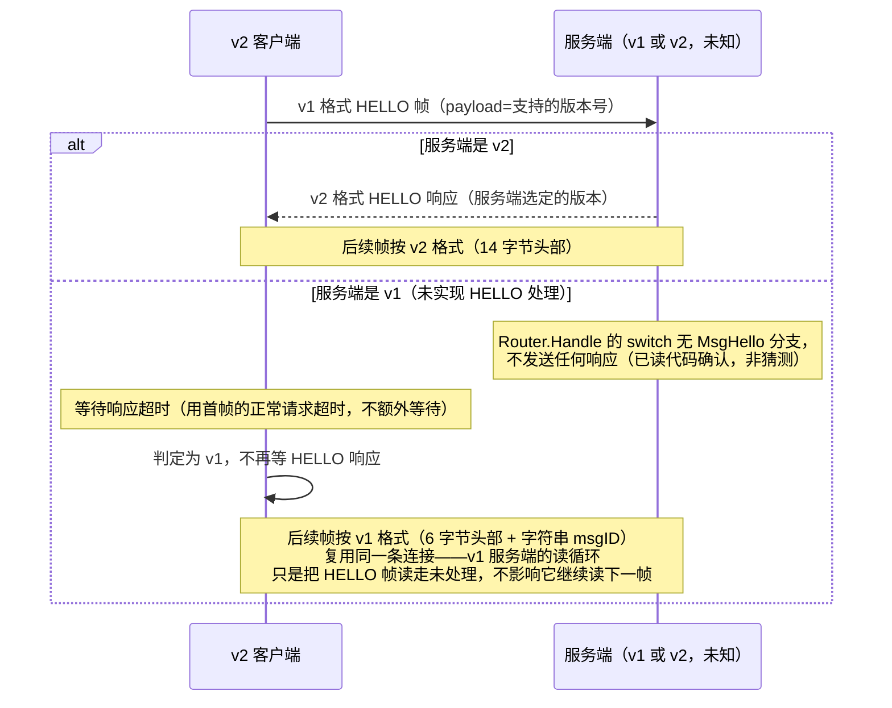

# RFC: BANLV v2

> **状态：开发已放行，本文档仍为纯设计文档（零代码改动）。** 2026-08-20
> 作者裁决：BANLV v2 开发放行，场景裁决为"写多读少、甚至可以不回调"——真实
> 负载是 QuantScout 每日批量导出 5241 行行情快照全量写入
> （`docs/iteration-2026-08-20-quantscout-realdata-fixes.md`），而非双向交互式
> 请求-响应。本轮修订（新增 §11"交互模式：写多读少场景适配"，更新 §7 中
> `corr_id`/`BYE` 两条的裁决状态）即为该场景裁决的落地。本文档仍然不修改
> `bannet/`、`client/`、`docs/BANLV-协议规范.md` 里描述的任何 v1 行为——v1 是且
> 仍是当前的生产协议，本轮改动全部是 v2 设计层面的追加。
>
> dubbo-go Triple 协议调研已完成（`docs/research/triple-协议调研.md`），结论
> 已折算进 §7 开放问题与 §9/§10 两节新增设计；§9 Schema Descriptor 与 §10
> 机读错误码分类学，均为纯设计，不涉及任何代码改动。

## 1. 动机

BANLV v1 一直"够用"，但 QuantScout 用 5241 行真实行情做全量实测这一轮，暴露了
三个都指向同一个根因的语义缺口——**协议本身不知道"这是什么类型的数据"**，
类型是靠 key 前缀事后猜的，猜不准的地方就出错：

1. **响应体没有结构化的错误细节**（对应 D2，见
   `docs/iteration-2026-08-20-quantscout-realdata-fixes.md`）：`dropped` 响应
   本来什么原因都不带，v1.1 用一个追加字段的方式补丁式地塞了 `reason` 进去
   （见 `docs/BANLV-协议规范.md` §3.4）——能用，但只是把本该在协议设计阶段
   就有的结构，事后拿协议扩展的方式补回来。
2. **数据类型不是协议的一等公民，靠 key 前缀猜**（对应 D3）：`dropBackward`
   的单调性检查假设 key 是 `设备:时间戳` 形状，行情快照的
   `quote:<日期>:<代码>` 恰好也能被同一套启发式误读——因为协议本身根本不知道
   这条数据是"行情快照"还是"IMU 帧"，只能靠 `service/ingesthook/schema` 在
   应用层按前缀猜。v1.1 的修法是"已注册 schema 的前缀跳过这项检查"，是对症但
   不治本：只要类型判断还停留在字符串前缀匹配，下一个新类型踩坑只是时间问题。
3. **量纲/字段契约没有协议层的落脚点**（对应 D4）：`volume` 单位是"手"这件事
   现在只能写在 Go 源码注释与建表 DDL 注释里，靠人读文档去对齐——协议帧里没有
   任何位置能声明"这条数据遵循哪个类型契约"，类型契约就只能是纯约定，没有
   协议层的强制力。

这三件事的共同解法是同一个：**把数据类型提升为协议的一等公民**，与
`service/ingesthook/schema` 的注册表对齐（`quote=1` 这样的类型号，直接对应
schema 注册表里的校验器），校验分派、单调性策略都按 `type` 走，不再靠 key
前缀猜。

## 2. 新帧格式

```
[magic+ver u16][flags u8][opcode u8][type u16][corr_id u32][dataLen u32][data bytes]
```

固定头部 14 字节（相比 v1 的 6 字节头部 + 变长 msgID，v2 头部整体变长但是
**定长**——不再有变长的 msgID 字符串，opcode 改成定长数字，见第 3 节）。

| 字段 | 长度 | 说明 |
|---|---|---|
| `magic+ver` | u16 LE | 高字节固定魔数（草案值 `0xBA`，"BanDB" 的缩写谐音），低字节协议版本号（v2 起始值 `0x02`）。存在的意义见 §5 协商流程——v1 帧完全没有这个字段，据此可以从字节层面区分"这是不是 v2 帧"，而不必先解析完整帧才发现版本不对。 |
| `flags` | u8 | 位标志，本轮全部保留未定义。候选用途（**开放问题，见 §7**）：bit0 压缩负载、bit1 流式/分片消息。是否真的做、怎么做，等 dubbo-go Triple 调研结果落地后再定。 |
| `opcode` | u8 | 数字操作码，取代 v1 的字符串 msgID，见 §3 对照表。 |
| `type` | u16 | 数据类型号，与 `service/ingesthook/schema` 的注册表对齐，见 §3。`0` 保留为"未声明类型"（向后兼容语义，见 §6）。 |
| `corr_id` | u32 | 请求关联 ID，客户端赋值、服务端在对应响应里原样带回。解锁流水线——v1 严格"发一帧、收一帧"的限制来自没有办法把响应对应回具体请求；有了 `corr_id`，一条连接上可以有多个在途请求，响应按 `corr_id` 匹配，不必按发送顺序返回。**是否真的做流水线**是本轮的开放问题（见 §7），但字段先留出来。 |
| `dataLen` | u32 LE | 负载长度，与 v1 语义相同。 |

**去掉了变长 msgID**：v1 的 `idLen`+`msgID bytes` 整体被 `opcode`（1 字节数字）
取代。这不是省字节的优化，是"操作码应该是协议定义的枚举，不是运行时字符串"
这个立场的直接后果——字符串 msgID 理论上可以是任意值，数字 opcode 才有真正
意义上的"协议版本内有效值集合"。

## 3. opcode / type 对照表

### 3.1 opcode（数字操作码，取代 v1 字符串 msgID）

高位区分方向：`0x00-0x7F` 是请求，`0x80-0xFF` 是响应。

| opcode | 方向 | 含义 | 对应 v1 msgID |
|---|---|---|---|
| `0x01` | 请求 | PUT | `"PUT"` |
| `0x02` | 请求 | GET | `"GET"` |
| `0x03` | 请求 | DEL | `"DEL"` |
| `0x04` | 请求 | SCAN | `"SCAN"` |
| `0x05` | 请求 | HELLO（版本协商，见 §5） | `"HELLO"`（v1 已声明但零调用方） |
| `0x06` | 请求 | BYE（保留，语义待定） | `"BYE"`（v1 已声明但零调用方） |
| `0x80` | 响应 | OK | `"OK"` |
| `0x81` | 响应 | ERR | `"ERR"` |

v1 的 `HELLO`/`BYE` 是声明但从未实现握手/挥手语义的保留常量（见
`docs/BANLV-协议规范.md` §2）——v2 第一次真正给 `HELLO` 赋予行为（版本协商），
`BYE` 仍然保留但本轮不定义具体语义。

### 3.2 type（数据类型号，与 schema 注册表对齐）

| type | 含义 | 对应 `service/ingesthook/schema` 注册表 |
|---|---|---|
| `0` | 未声明类型（向后兼容默认值，见 §6） | 无——不做类型相关的校验/单调性分派，退化为 v1 行为 |
| `1` | 行情快照（quote） | `quote:` 前缀，`QuoteSnapshot` 校验器 |
| `2+` | 后续新增类型 | 每新增一个 `schema.Register` 的前缀，分配一个 type 号 |

`type` 与 schema 前缀是**多对一或一对一**的映射关系（草案阶段假设一对一，
后续如果同一类型需要多个 key 前缀共享校验规则，可以放宽）。分派规则从
"按 key 前缀最长匹配"改为"按 `type` 字段直接查表"——精确、不需要猜，也
不再受"两种类型的 key 前缀恰好模式相似"这类问题困扰（D3 的根因）。

## 4. 响应体结构化

v1.1 的 `dropped` 响应用追加字段的方式补了 `reason`（见
`docs/BANLV-协议规范.md` §3.4）。v2 把这个补丁转正为正式设计：

```
[opcode=0x80/0x81][type][corr_id][statusCode u16][reasonLen u16][reason][payloadLen u32][payload]
```

（省略了帧头部分，只写响应体的结构；`statusCode` 数字化 v1 的字符串 status，
`payload` 是可选的结构化返回值——GET 的 value、SCAN 的命中集，都归到这个统一
形状里，而不是像 v1 那样每种操作各自定义响应体尾部格式。）

这不是本轮的重点设计，列在这里是为了让 §1 提到的"D2 的补丁转正"有具体落点，
细节（`statusCode` 的枚举值、`payload` 的内部格式）留到定稿阶段再展开。

## 5. 协商流程：复用 HELLO，v1/v2 零破坏共存

**核心思路**：v2 客户端连接后先发一个 v1 格式的 HELLO 帧（用 v1 的
`[dataLen][idLen]["HELLO"][payload=客户端支持的版本]`），根据是否收到响应
判断对端是 v1 还是 v2：



**这一步已经用代码验证过、不是假设**：`service/router.go` 的 `Router.Handle`
switch 语句只有 `MsgPut`/`MsgGet`/`MsgDelete`/`MsgScan` 四个 case，没有
`MsgHello`——v1 服务端收到 HELLO 帧会静默不回应（连接不断开，只是这一帧没有
响应）。这意味着：

- v2 客户端**不能**用"阻塞等 HELLO 响应"的方式做协商——会在 v1 服务端上
  永远等下去。必须用有限超时（建议直接复用该客户端本来就有的单次请求超时），
  超时即判定为 v1，**不视为错误**。
- 复用同一条连接可行的前提是：v1 服务端的读循环（`bannet/connection.go` 的
  `StartReader`）逐帧独立读取、不会因为某一帧没人处理就卡住下一帧的读取——
  这一点已经是 v1 现有实现的行为，v2 协商可以依赖它，不需要额外改 v1。

### 5.1 HELLO 负载最小格式（实现定版 2026-08-20）

本节填上 §5 与 §11.2.1 都留空的"负载具体格式"——这是本 RFC 唯一允许在
实现阶段回写的文档改动（第一阶段实现见 `bannet/negotiate` 包，向量见
`docs/banlv/vectors-v2.json` 的 `negotiation` 分区）。`§11.2` 提到的"字段
格式与 §5 的 payload 一样留到定稿阶段"以本节为准，不再另行定义。

**请求**（v2 客户端发送的、§5 描述的那个 v1 格式 HELLO 帧，
`msgID="HELLO"`，负载即本节定义——注意这与 §3.1 opcode 表里数字化的
`0x05`/HELLO 是两回事：`0x05` 是 v2 原生帧格式下的 opcode 分派项，协商
阶段客户端还不知道对端是否支持 v2，不可能、也不需要用 v2 帧格式发探测帧）：

```
[version u8][ackPref u8]
```

- `version`：客户端支持的最高 BANLV 版本号，本阶段固定写 `0x02`。
- `ackPref`：客户端期望的 ack 档位（对应 §11.2 的三档），本阶段固定写
  `0x00`（=`every`）——`window`/`none` 两档的编号（`0x01`/`0x02`）保留但
  本阶段客户端不发送，服务端即使收到非 `0x00` 也一律按 `every` 处理
  （见下）。

**响应**（服务端识别出探测帧后回复的、§5 描述的那个 v2 格式帧）：

- 帧头：`opcode=0x80`（复用 §3.1 已有的 OK，未单独定义 HELLO 专属响应
  opcode）、`type=0`、`corr_id=0`（探测请求是 v1 帧，没有 `corr_id` 字段
  可回带，固定为 0，不是"这一位本来就没用"的占位，是"请求方没有这个
  概念"的诚实反映）。
- 负载：`[version u8][ackPref u8]`，与请求同形状——`version` 是服务端
  选定的协议版本（本阶段恒为 `0x02`，只有未来出现 v3 才需要真正的版本
  协商逻辑），`ackPref` 是服务端确认的 ack 档位（本阶段恒回 `0x00`=
  `every`，忽略请求里携带的 `ackPref` 取值——`window`/`none` 两档要到
  后续阶段才有真实行为，本阶段服务端不承诺遵守客户端请求的档位，只是
  诚实回声"我这边现在只有 every"）。

真正的 v1 服务端（`Router.Handle` 无 `MsgHello` case）收到这个探测帧后
不会发送任何响应字节——v2 客户端据此判断对端是 v1（见 §5 的超时降级
流程），这条路径没有响应负载可定义。

## 6. 向后兼容矩阵

| 客户端 \ 服务端 | v1 | v2 |
|---|---|---|
| v1 客户端 | 正常（现状） | **需要 v2 服务端保留 v1 帧格式解析能力**（双栈：先按 magic 字节判断，非 v2 magic 则退回 v1 解析路径） |
| v2 客户端 | 依 §5 协商降级为 v1 格式通信，`type` 概念不存在，行为等价于今天 | 正常，`type=0` 时行为等价于 v1（未声明类型，不做类型相关分派） |

**v2 服务端必须双栈**：这是本 RFC 认为不能妥协的一条——协议升级不能要求
所有 v1 客户端同时升级。具体做法（草案）：服务端读到帧头前 2 字节后先判断
是否匹配 v2 magic（`0xBA`）；不匹配则整体按 v1 的 6 字节头部重新解释这两个
字节（v1 头部的前 4 字节是 `dataLen u32`，与 v2 的 `magic+ver u16` 在字节
布局上不冲突，因为它们是两套完全独立的头部结构，服务端在读到这 2 字节时
就已经能分岔，不需要读完整个头部才能判断）。

## 7. 开放问题（已按 Triple 调研结论更新裁决状态）

- **流水线（`corr_id`）是否真的做**：**已裁决：做，但只做窗口语义，不做
  全功能流水线**（裁决理由与设计见 §11.3）。2026-08-20 作者场景裁决把"是否
  做"的悬而未决变成了确定输入——BANLV 的实际负载正是量化数据批量写入
  （QuantScout 每日 5241 行行情快照全量写入），这恰好是"连续发多条不等
  响应、批量收一个汇总"能受益的场景，此前"量化数据流目前是批量写入，不是
  双向流式交互"这句话不再是"不做"的理由，反而是"该做窗口化流水线"的理由。
  但这个场景不需要 Triple 调研确认的"长度前缀消息+显式流结束信号"这个下限
  之上的全部复杂度——不需要任意乱序请求按 `corr_id` 精确匹配响应，窗口内
  写帧严格按到达顺序处理、窗口边界严格 FIFO 关闭即可，`corr_id` 只承担
  "标记这是哪个窗口"这一件事。复杂度因此远低于 Triple 式的全功能流水线，
  具体设计见 §11.2.2。
- **`flags` 的压缩/流式位**：**部分裁决**。Triple 用 HTTP/2 的 `END_STREAM`
  标志表达"流结束"，是流式语义里唯一不可或缺的比特（见调研 §3、§8 裁决表）。
  若 BANLV v2 未来真的做流式，`flags` 应至少留一位给等价的"流结束"语义
  （草案占位：bit1）。压缩位（草案占位：bit0）**调研没有找到 Triple 相关
  的具体设计可供参考**（压缩不是 Triple 强调的设计点），仍然完全开放，
  留待有真实需求（如大负载场景）时单独评估压缩算法选型。
- **`payload` 的结构化格式**：**已裁决方向，细节未定**。Triple 对"错误"与
  "正常返回值"分别用完全不同的模型表达（HTTP/2 trailer vs 消息体），不
  勉强统一（见调研 §4、§8）。BANLV v2 采纳同样的取向：`payload`（正常返回
  值，如 GET 的 value、SCAN 的命中集）与 §10 新增的错误码分类学各自独立
  设计，不强求用一套 TLV 格式同时表达两者。`payload` 内部具体编码格式
  （自定义 TLV vs JSON）仍未定。
- **`BYE` 的语义**：**部分裁决**（裁决理由与设计见 §11.4，取代本节与 §3.1
  此前"只保留 opcode 号位、不定义行为"的记录）。Triple 调研确实未涉及连接
  优雅关闭的等价机制，这条开放问题不是被调研输入解决的，而是被 2026-08-20
  场景裁决直接触发——ack=window/none 下，连接关闭前如果没有一次对账，未
  确认的尾部写就永远无法定位是谁的责任。`BYE` 因此第一次被赋予真实行为：
  在 ack=window/none 的连接上，`BYE` 触发"收尾当前未关闭的窗口（若有）+
  回传自连接建立以来的「接收/接受/拒绝」三项计数摘要"，客户端必须收到这个响应才能真正
  断开连接。ack=every 连接上 `BYE` 的语义不变（仍是保留位、可选的礼貌关闭，
  不影响现状）。
- **`type` 号的分配与治理**：**仍然开放**。Triple 用 `Service-Name`+方法名
  的字符串路径做服务标识（类似 gRPC 的 `:path`），不是数字化的类型号，
  没有直接可借鉴的"数字类型号治理"先例；调研没有提供新的输入。§9 新增的
  Schema Descriptor 里 `TypeID` 字段的治理问题与此相同，一并留待需要时
  设计一个类似 protobuf 字段号规则的分配规范（如"1-999 保留给核心数据类型、
  1000+ 开放给业务自定义"这类分段策略）。

## 8. v1 → v2 测试向量迁移方案

`docs/banlv/vectors.json` 当前的 12 条向量全部是 v1 格式，是 Go/Python 两侧
实现共同验证的锚点（见 `docs/BANLV-协议规范.md` §6）。v2 定稿后的迁移方案
（草案）：

1. **不修改现有 12 条向量**——它们验证的是 v1 帧格式，v1 协议本身不变，这些
   向量长期有效。
2. **新增 `docs/banlv/vectors-v2.json`**，独立的向量文件，覆盖 v2 帧格式
   （新头部布局、数字 opcode、`type` 分派、HELLO 协商的请求/响应对）。不
   合并进同一个文件，是因为 v1/v2 是两套完全不同的字节布局，混在一起容易
   在生成脚本里出错、也不便按协议版本分别审阅。
3. **新增 `docs/banlv/vectors-negotiation.json`**（或作为 vectors-v2.json 的
   一个分区）：专门覆盖 §5 协商流程的边界情况——v2 客户端连 v1 服务端超时
   降级、v2 客户端连 v2 服务端协商成功两条路径都要有向量级别的回归锁定，
   不能只在集成测试里测，因为协商失败的后果（连接卡死）比帧解析错误更隐蔽。
4. **Go/Python 两侧的向量测试文件各自新增**（`bannet/vectors_v2_test.go`、
   `client/python/test_bandb_client_v2.py` 或类似命名），与 v1 测试文件并存，
   不合并——两套协议版本的测试意图不同，合并会让测试文件同时承担"锁定 v1
   不变"与"验证 v2 新增"两个不同职责，不利于将来任何一侧单独演进。

## 9. Schema Descriptor：类型拥有全部语义

### 9.1 现状：同一个类型的语义散落在四五个不相关的地方

`quote`（行情快照）这一个数据类型，今天的语义分散在：

- **key 布局约定**：`quote:<日期>:<代码>` 只写在 `service/ingesthook/
  schema/quote.go` 的包注释里，是一句自然语言描述，没有任何代码强制它。
- **单调性策略**：`dropBackward` 对已注册 schema 的类型无条件跳过（v1.1 修
  D3 的方式），这个"quote 类型不需要单调性检查"的事实，体现为 filter.go
  里一段 `if hasSchema` 的旁路逻辑，不是 quote 类型自己声明的属性。
- **校验规则**：`QuoteSnapshot.Validate` 方法体，这是唯一一处"结构化"的
  部分（至少是个接口实现）。
- **量纲契约**：`volume` 是"手"这件事，写在 `quoteRecord.Volume` 字段的
  Go 注释里，`docs/clickhouse-schema.md` 的建表 DDL 注释里再抄一遍——两处
  手写、两处都可能各自漂移。
- **错误信息**：`fmt.Errorf("quote: non-positive price: %s=%v", ...)`
  这类临时拼出来的字符串，散落在 `Validate` 方法内部，与 §10 要设计的
  机读错误码毫无关联。
- **投递分区假设**：`quote:<日期>:<代码>` 日期在前这个选择，能让投递按天
  成批、ClickHouse 按月分区——但这个"key 布局与投递策略的关联"这件事，
  目前只存在于人的理解里（体检报告与本 RFC 的动机段落），没有任何代码或
  配置显式声明"这个类型应该怎么投递"。

**六个不同子系统，六份关于同一个类型的、互相不知道对方存在的声明。** 这正是
§1 动机里"数据类型不是协议一等公民"的具体后果——不只是协议帧里没有 `type`
字段，是**代码里也没有一个单一的地方能回答"quote 类型到底是什么"**。

### 9.2 设计：一个类型 = 一份 Schema Descriptor

```go
// 草案接口形状，不是最终 Go 签名——用于表达"一个类型的全部语义在一个地方声明"
// 这个设计意图，定稿时再确定具体字段类型与包结构。
type SchemaDescriptor struct {
    TypeID   uint16 // 对应 §3.2 协议帧里的 type 字段；治理问题见 §7
    Name     string // "quote"

    KeyLayout     KeyLayout     // 声明式的 key 形状，替代"包注释里写一句人话"
    TimeSemantics TimeSemantics // 这个类型要不要单调性检查、检查哪个字段
    Validation    Validator     // 即今天的 schema.Validator 接口，行为不变
    Units         map[string]string // 字段名 -> 量纲，如 {"volume": "lots"}
    ErrorCodes    []ErrorCode   // 见 §10，这个类型的校验器可能产生的机读错误码集合
    DeliveryHint  DeliveryHint  // 分区/去重键提示，供投递层与下游建表参考
}

// KeyLayout 用分隔符+字段名列表声明 key 形状，而不是一句自然语言注释。
// 例：quote 类型 = KeyLayout{Delimiter: ":", Fields: []string{"prefix", "date", "code"}}
type KeyLayout struct {
    Delimiter string
    Fields    []string // 有序字段名，"date"/"code" 这类名字本身即语义
}

// TimeSemantics 声明这个类型是否需要单调性保证，以及哪个 KeyLayout 字段
// 扮演"时间戳"角色——替代 filter.go 里"有没有注册 schema"这个旁路判断。
type TimeSemantics struct {
    Kind      TimeKind // None / StrictlyIncreasing / NonDecreasing
    KeyField  string   // 若 Kind != None，指明 KeyLayout.Fields 里哪个字段是时间戳
}

// DeliveryHint 给投递层的分区/去重建议，不是强制指令——投递层可以选择忽略。
type DeliveryHint struct {
    PartitionByKeyField string   // 例："date"，对应 ClickHouse DDL 的 PARTITION BY
    DedupKeyFields      []string // 例：["code", "date"]，对应 ReplacingMergeTree ORDER BY
}
```

`quote` 类型注册后大致是：

```go
schema.RegisterDescriptor(SchemaDescriptor{
    TypeID: 1,
    Name:   "quote",
    KeyLayout: KeyLayout{Delimiter: ":", Fields: []string{"prefix", "date", "code"}},
    TimeSemantics: TimeSemantics{Kind: None}, // 日频快照允许乱序/重复，不需要单调性
    Validation: QuoteSnapshot{},
    Units: map[string]string{"volume": "lots"},
    ErrorCodes: []ErrorCode{ErrQuoteMissingField, ErrQuoteNonPositivePrice, ...}, // 见 §10
    DeliveryHint: DeliveryHint{PartitionByKeyField: "date", DedupKeyFields: []string{"code", "date"}},
})
```

### 9.3 各子系统如何从 Descriptor 派生行为（而不是各自维护一份）

| 子系统 | 现状 | Descriptor 化之后 |
|---|---|---|
| 协议 `type` 字段分派（§3.2） | 按 key 前缀最长匹配猜 | 直接读 `TypeID`，Descriptor 是唯一真相来源 |
| 落盘前清洗（单调性检查） | `hasSchema` 旁路判断是否跳过 | 读 `TimeSemantics.Kind`，`None` 则跳过，`StrictlyIncreasing`/`NonDecreasing` 则按 `TimeSemantics.KeyField` 指定的字段检查——不再是"有没有注册就跳过"的粗粒度旁路，是每个类型自己声明要不要、查哪个字段 |
| schema 校验 | `Validator.Validate` | 不变，`Validation` 字段就是它 |
| 量纲文档 | 两处手写注释 | `Units` 是唯一声明来源，文档（`docs/clickhouse-schema.md` 之类）应该是从这里生成/引用，不是独立手写第二份 |
| 投递分区 | 人脑理解 + README 的一句话 | 投递层读 `DeliveryHint` 决定批次边界，下游建表脚本可以从 `DeliveryHint` 生成 `PARTITION BY`/`ORDER BY` 建议，不用每个新类型都重新讨论一遍"这个类型该怎么分区" |

### 9.4 与现有代码的关系（不破坏，是重构方向）

`service/ingesthook/schema.Register(prefix, validator)` 这个现有 API 不需要
立刻废弃——`SchemaDescriptor` 可以看作它的超集：`Register` 等价于构造一个
`TimeSemantics.Kind=None`（沿用 v1.1 的"有 schema 就跳过"逻辑）、
`Units`/`ErrorCodes`/`DeliveryHint` 留空的 Descriptor。迁移路径是渐进式的
（新类型直接用 Descriptor 声明全部字段，旧的 `quote` 类型逐步把散落的
量纲注释、错误信息迁移进 Descriptor），不需要一次性重写。

## 10. 机读错误码分类学

### 10.1 现状：字符串是唯一的错误表示

v1.1 的 `reason` 字段（`docs/BANLV-协议规范.md` §3.4）解决了"客户端知道
具体错误"这个问题，但 `reason` 是自由格式的人读字符串
（`"quote: non-positive price: open=-1"`），客户端要做任何程序化处理
（区分"是价格问题"还是"是字段缺失问题"）都得解析字符串前缀——这既脆弱
（字符串措辞一改，客户端的解析逻辑就断），也不是"机读"。

### 10.2 设计：码 + 人读字符串双轨，不是二选一

```
[code u16][reasonLen u16][reason: UTF-8 字符串]
```

`code` 是机读的、跨版本稳定的数字；`reason` 是给人看的、可以随时改措辞的
描述——两者都发，客户端可以只读 `code` 做程序化分支，也可以把 `reason`
原样展示给运维排查，互不冲突。这直接对应 §8 裁决表里 Triple"两套错误模型
服务不同场景、不强求统一"的原则：这里不是要统一成一套，是要**让机器与人
分别有自己够用的表示**。

### 10.3 分类结构：与 A 段修复新增的 metrics 计数器对齐

不凭空设计一套分类，直接对齐这轮 bannet 健壮性审计（见
`docs/iteration-2026-08-20-bannet-robustness-audit.md`）里新增/已有的
`internal/metrics` 计数器——这些计数器已经是这个系统事实上的"错误类目"，
错误码分类学应该是它们的机读化，不是另起一套无关的分类：

| 码段 | 类目 | 对应现有 metrics 计数器 | 说明 |
|---|---|---|---|
| `0x1xxx` | 帧/传输层 | `FramesDroppedMalformed`、`FramesDroppedOversized` | 帧本身有问题（长度不符、超限），与业务类型无关 |
| `0x2xxx` | 时序 | `FramesDroppedNonMonotonic` | 时间戳/单调性问题；具体是否适用取决于 §9 的 `TimeSemantics` |
| `0x3xxx` | schema 校验 | `FramesDroppedSchema` | 每个类型自己的校验失败，子码按 §9 `SchemaDescriptor.ErrorCodes` 分配（如 `0x3001`=quote 缺字段、`0x3002`=quote 非正价格、`0x3003`=quote OHLC 不一致、`0x3004`=quote 涨跌幅超限） |
| `0x9xxx` | 内部 | `PanicsRecovered` | **不通过协议下发给客户端**——这是服务端内部异常，客户端不该看到"服务端刚从一个 panic 里恢复"这种内部细节，只在服务端日志/metrics 里体现；列在这里是为了分类完整性，不是要开一个新的响应路径 |

`0x3xxx` 段的具体子码分配权下放给各 `SchemaDescriptor.ErrorCodes`——这是
`type` 治理问题（§7 仍开放）的一个自然延伸：`type=1`（quote）拥有
`0x3001`-`0x30FF` 这个子区间，`type=2` 拥有下一个区间，以此类推，避免不同
类型的错误码手工分配时互相冲突。具体的区间划分规则本轮不定稿，留给 `type`
号治理方案一并设计。

### 10.4 与 SCAN 状态码的关系（不是替代，是分层）

`proto.StatusOK`/`StatusNotFound` 等 v1 状态字符串（`docs/BANLV-协议规范.md`
§3.4 状态码表）描述的是"这次操作的宏观结果"（成功/查无/过载/服务端错误），
是协议级别的粗粒度状态；`code`（本节）描述的是"如果结果是拒绝，具体因为
什么业务/校验原因"，是更细粒度的补充，两者不冲突、不重叠——`code` 只在
`status=dropped` 这一种宏观状态下才有意义，其余状态（`ok`/`notfound`/
`overloaded`/`error`）不需要、也不应该附带 `code`。

本节和全文档一样，是给定稿阶段的起点，不是可以直接照做的实现清单。

## 11. 交互模式：写多读少场景适配

### 11.1 场景与设计目标

2026-08-20 作者裁决明确了 BANLV v2 要适配的真实负载：**写多读少，甚至可以
不回调**。真实例子是 QuantScout 每日批量导出 5241 行全市场行情快照全量写入
BanDB（`docs/iteration-2026-08-20-quantscout-realdata-fixes.md:1,8`）——客户端
灌数据进来，大多数时候不需要逐条等响应。

这个场景与 v1/v2 现有设计的默认假设正面冲突。已用代码核实（不是猜测）：

- **v1 是严格的"发一帧、收一帧"协议**：`docs/BANLV-协议规范.md:159` 明文
  "一条连接上必须「发一帧、收一帧」之后才能发下一帧，不支持流水线"；Go SDK
  的 `client/conn.go:63`（`roundTrip`）逐字实现了这一点——写完整帧、
  `io.ReadFull` 读完整个响应头+负载才返回，中间没有任何异步空间。
  `client/conn.go:33` 的注释把这一点显式标注为不变量："conn 不可被并发使用"，
  并发只能靠连接池（多条独立连接）提供，不是单连接内的流水线。
- **Python 客户端更彻底：无连接池**（`client/python/bandb_client.py:13`：
  "无连接池：BANLV 是严格请求-响应协议，一条 socket 一次只能有一个在途请求；
  需要并发时由调用方开多个 BanDBClient 实例"）——QuantScout 这类调用方今天
  只能靠"开多个客户端实例各发各的"或者"5241 次round-trip 串行等待"来写完
  一批数据，两者都是为了凑合"发一帧等一帧"模型而付出的代价，不是这个场景
  本该有的样子。
- **v1 的"ok"确实意味着已落盘，不是提前应付**：`service/router.go:228-236`
  （`handlePut`）在 `r.store.Write(cmd)` 成功之后才 `sendOK`；
  `service/fsm.go:104-127`（`Write`/`writeStandalone`）显示 standalone 模式下
  这一步是"先 WAL append+fsync、再写 memtable"两步都成功才返回。也就是说
  v1 逐条 ack 的语义是诚实的——本节要设计的 ack=window/none 拿掉的是"每条
  都等"这件事本身，不是拿掉"ack 意味着什么"这个承诺，下面每一档都要单独
  交代它对这个承诺做了什么让步。

设计目标：在不破坏 v1 语义、不牺牲"失败必须可见"这条底线的前提下，给
"写多读少"场景一个比"5241 次 round-trip"更高效、又不掉进"批量写完全黑箱"
陷阱的路径。

### 11.2 ack 三档设计

三档只作用于**写操作**（PUT/DEL）；GET/SCAN 不受影响，见 §11.5。三档由客户端
在建连后选定，搭载在 §5 已经定义的 v2 HELLO 请求/响应负载里传递——本节写
下这段话时，§5 本身尚未规定这个负载的内部字段格式（只定出了"客户端支持
的版本"这一项）；**格式已于 §5.1 定版（实现定版 2026-08-20）**：请求负载
`[version u8][ackPref u8]`，`ackPref` 正是本节这三档的编号，本阶段客户端
固定发 `0x00`（=`every`）、服务端固定回 `0x00`，`window`/`none` 两档的编号
已保留但行为留给后续阶段——本节只是在这个负载里追加"客户端期望的 ack
档位"这一项协商内容，不是在 §5 的握手流程之外另开一条协商通道，也不改变
§5 描述的"发 HELLO、按超时判断对端版本"这个流程本身。字段的具体格式以
§5.1 为准，不在本节重复定义——这不影响本节的核心设计，档位选定后的行为
才是本节的重点。

#### 11.2.1 `ack=every`：逐条响应（v1 现状，不变）

即 §11.1 描述的现状：每条 PUT/DEL 都等一个 `OK`/`ERR` 响应才发下一条。**读操作
（GET/SCAN）恒定使用这一档**，与写操作选了哪一档无关（见 §11.5）。低频关键写
（如需要立即确认的配置类写入，如果未来有这种用途）也应留在这一档——`ack` 是
按连接选择的模式，不是按每条帧临时切换的旗标，一条连接要么整体走 window/none，
要么整体 every，混合会让"当前窗口状态"变成一个需要额外协商的东西，不值得。

#### 11.2.2 `ack=window`：窗口批量确认

客户端连续发 N 条写帧不等响应，服务端每 N 条或每个 `FLUSH` 帧回一个汇总响应。

**新增 opcode**（在 §3.1 表格基础上新增，不修改原表）：

| opcode | 方向 | 含义 |
|---|---|---|
| `0x07` | 请求 | FLUSH——客户端显式关闭当前窗口，无负载 |
| `0x82` | 响应 | WINDOW_ACK——窗口关闭时的汇总响应 |

**`corr_id` 的窗口边界语义**：客户端为每个窗口分配一个 `corr_id`（如递增的
窗口序号），窗口内**所有** PUT/DEL 帧都携带这同一个 `corr_id`——它不是"这一条
请求的关联 ID"，是"这一批请求属于哪个窗口"的分组标记。服务端按连接维护当前
窗口状态机：

- 收到写帧且其 `corr_id` 与当前打开的窗口不同：视为客户端已经开始下一个窗口，
  隐式关闭上一个窗口（对上一个窗口发 `WINDOW_ACK`），再用新 `corr_id` 打开
  新窗口。
- 收到写帧且计数达到服务端配置的 N（安全阀，独立于客户端自己的批次划分，
  只是"不能无限攒着不回"的上限，见下）：关闭当前窗口，发 `WINDOW_ACK`。
- 收到 `FLUSH` 帧：无论计数多少，立即关闭当前窗口，发 `WINDOW_ACK`（`FLUSH`
  帧本身不携带需要匹配的 `corr_id`——它的语义就是"现在关闭"，`WINDOW_ACK`
  里的 `corr_id` 取被关闭窗口自己的 `corr_id`，不是 `FLUSH` 帧的）。
- 收到 GET/SCAN：见 §11.5，隐式触发上面第二条的关闭逻辑。

这样客户端不需要与服务端提前协商"N 是多少"——服务端的 N 只是一个背压安全阀
（类似 `MaxPackageSize` 的定位，防止客户端一直不发 `FLUSH` 导致服务端无限
攒积压），客户端按自己的批次边界发 `FLUSH` 即可保证及时拿到确认，不依赖猜中
服务端的 N。

**`WINDOW_ACK` 响应体**（与 §11.2.3 的 `STAT_ACK` 共享同一格式，见下）：

```
[corr_id u32][received u32][accepted u32][rejected u32][firstErrCode u16][firstErrReasonLen u16][firstErrReason]
```

`received` 是这个窗口内成功解出的写帧数（含被拒绝的），`accepted`+`rejected`
应等于 `received`；`firstErrCode`/`firstErrReason` 是窗口内第一个被拒绝帧的
错误码（复用 §10 的机读错误码）与人读原因，供客户端快速定位问题类型，不是
逐条错误列表——**窗口汇总不提供逐帧结果**，这是本档相对 `ack=every` 付出的
唯一代价：客户端知道"这一窗口收了多少、拒了多少、第一个错误长什么样"，但
不知道"具体是哪一条被拒"。这个代价对"写多读少"场景是可接受的（写入方通常
按 quote 类型批量重放整批即可恢复，见 §11.2.3 的重放安全性讨论），换来的是
不必逐条等待的吞吐。

**为什么这不会重新引入 v1 §4.2 明确拒绝的"响应错位"问题**：v1 严格顺序响应
的理由是"服务端不能发未经请求的消息，否则客户端会把它误读成下一个请求的
响应，造成整条连接的响应错位"（`docs/BANLV-协议规范.md:161`）。`ack=window`
把这条不变量从"每帧一个响应"减弱为"每个窗口一个响应、窗口按 FIFO 顺序关闭"
——客户端永远知道边界在哪，因为边界是客户端自己划的（`corr_id` 变化或发
`FLUSH`），不存在"服务端主动、客户端没预期"的响应。真正的风险不是响应错位，
是 `client/conn.go:69,84` 已经处理过的那类风险的放大版：v1 下 `conn.broken`
意味着"丢了一个请求的结果"，`ack=window` 下同样的连接中断意味着"丢了当前
窗口里最多 N 条帧的结果"——这正是 §11.2.3 强制对账不是可选项、而是
`ack=none` 存在前提的原因，也是本档虽然有窗口汇总、仍然建议对大批量写入
额外做 §11.2.3 的对账实践的原因（窗口汇总本身在连接中途断开时同样会丢失，
"最后一个已确认的 WINDOW_ACK 之后"仍然是盲区）。

#### 11.2.3 `ack=none`：完全 fire-and-forget，强制对账

**必须诚实写清风险**：这个系统的核心纪律是防静默漂移——本仓库有过因为
"正常路径全绿、错误路径从未被测"而导致存储层静默丢数据的真实前科
（`docs/iteration-2026-08-13-silent-data-loss.md`，四处缺陷：写尾吞掉 I/O
错误、尾部残缺的文件整份读不到、启动期元信息被异步扫描抹掉，共同特征是
"调用方以为成功，实际没有"）。**那次前科的失败模式与这里不完全相同**——那
四处缺陷发生在 v1 的 `ack=every` 语义下，是"已经过了 ack 这一关、但底层
存储另有 bug 导致数据没有真的落地"；而 `ack=none` 是**主动拿掉 ack 这一层
本身**——网络丢包、连接中途断开、schema 校验拒绝、乃至服务端返回但客户端
根本没收（因为客户端压根没在等）——这些情况在 `ack=none` 下一律不可见。
两者的共同点是本节要强调的：**这个仓库里，"看起来成功"和"真的成功"之间的
缝隙一旦出现就是静默的、不会自己报警**——`ack=none` 是主动放弃了 v1 那种
"至少每条都有一次机会暴露错误"的保障，必须用别的机制补回来，而不是假装
这个缝隙不存在。

**设计强制缓解措施：客户端本地发送计数 + 会话结束时一条 STAT 查询对账**。
没有对账的 `ack=none` 不该存在——本节把"必须配对账"写成设计约束，不是
可选的最佳实践。

**新增 opcode**：

| opcode | 方向 | 含义 |
|---|---|---|
| `0x08` | 请求 | STAT——查询本连接自建立以来的「接收/接受/拒绝」统计，无负载 |
| `0x83` | 响应 | STAT_ACK——与 `WINDOW_ACK` 共享 §11.2.2 的响应体格式，`corr_id` 字段取发起该次 `STAT` 请求的帧本身的 `corr_id`（普通的请求-响应关联用法，不是窗口分组），计数范围是**整条连接自建立以来的累计值**，不因 `STAT` 查询而清零（`STAT` 是非破坏性读） |

`STAT`/`STAT_ACK` 本身走 `ack=every` 语义——它需要一个确定的答案，不适合
也不需要批量化。

**对账流程**：客户端在写入过程中维护一个纯本地计数器（每次成功把一条 PUT
帧写进 socket 就 +1，与服务端是否响应无关）。会话/批次结束时，客户端发一条
`STAT`，拿到服务端记录的 `received`/`accepted`/`rejected`，与本地发送计数
比对：

- `本地发送数 == received`：帧层面没有丢失，`rejected` 数与 §10 错误码
  分布告诉客户端具体是什么原因（校验、单调性等），**这不是异常，是正常的
  拒绝反馈**，客户端按 `firstErrCode` 定位问题类型即可。
- `本地发送数 != received`：网络/成帧层面出了问题（丢包、连接在完成写入
  前中途断开又被静默重连之类），对不上就必须报警，**不能"差不多就算了"**。
- `received == accepted + rejected`（协议不变量，若破坏本身就是服务端 bug）。

**诊断粒度**：`received`/`accepted`/`rejected` 分开计数而不是揉成一个总数，
是刻意的——`sent=5241, received=5100` 定位到网络/成帧层的丢失，
`received=5241, accepted=5200` 定位到策略/校验层的拒绝，两种问题的排查方向
完全不同，一个笼统的总数无法区分，等于没有诊断能力。

**对不上账之后能做什么**：`STAT_ACK` 的汇总没有逐行身份，定位不到"具体哪
一行"——补救手段是**全批次重放**，不是精确重发缺失的那几行。这个手段是
否安全，取决于重复 PUT 相同 key 是否幂等：已用代码核实——`storage/engine.go:275`
（`Engine.Put`）在内存跳表里对同一 key 是**覆盖写**（`m.active.insert`，
注释明确"覆盖写"），LSM 结构下同一 key 的新写入总是覆盖旧值，`quote:<日期>:
<代码>` 这个 key 布局对同一交易日同一标的的重复写入是良性覆盖，不会产生
"重复行"或版本冲突。全批次重放因此是安全的补救手段——代价是重放整批
（5241 行）比精确重发丢失的几行更浪费，但换来的是不需要协议层提供逐行
确认这个更复杂的能力。

**这个机制无法兜底的残余风险**（诚实列出，不是"设计已经完备"的假象）：
如果连接在客户端能发出 `STAT`/`BYE` 之前就整体中断——例如 `docs/BANLV-
协议规范.md:165-168` 描述的"帧头声明的 `dataLen` 超出实际可读字节，或连接
中途断开"这一类会导致读取阻塞/连接关闭、不产生任何响应的情形——客户端连
对账的机会都没有。缓解方式是**批次内做周期性 STAT 检查点**（而不是只在
批次结束时做一次），把"未确认尾部"的规模控制在一个检查点周期内，而不是
整个批次；但这仍然是把风险窗口缩小，不是完全消除——协议设计无法对抗
"连接说断就断"这个 TCP 固有事实，只能限制暴露面。

**实现契约提醒（本 RFC 范围之外，留给实现阶段）**：`received`/`accepted`/
`rejected` 必须是**按连接**累计的，不能复用现有 `internal/metrics/metrics.go:18-21`
（`FramesDroppedMalformed` 等）——那些是进程级全局 `atomic.Int64`
（`internal/metrics/metrics.go` 全文如此，`Snapshot()` 读的也是全局值），
一旦有第二个客户端或第二条连接，全局计数就回答不了"我这 5241 条里服务端
收了几条"这个问题。好消息是这不需要新的签名/契约变化就能实现：
`ingesthook.Filter.Handle(req bannet.Request) (bannet.HookAction, string)`
（`service/ingesthook/filter.go:64`）收到的 `bannet.Request` 本身已经带着
连接身份——`Request.Conn()` 返回的 `Conn` 接口自带 `ID() uint32` 与
`SetProperty`/`Property`/`RemoveProperty`（`bannet/handler/handler.go:50-56`）
这套连接级属性袋，正是为"业务代码需要在连接生命周期内挂状态"这类需求预留
的机制。因此 `received`/`accepted`/`rejected` 可以直接实现为连接建立时
`SetProperty` 一个计数结构、每次处理写帧时经由 `req.Conn().Property(...)`
取出并递增，不需要改动 `Filter.Handle`/`Request`/`Conn` 任何一个接口的
签名，与现有全局 `metrics` 并存而非取代——全局 metrics 服务于"整个服务的
可观测性"这个不同的目的，两者职责不同，不应该合并成一个。真正留给实现
阶段的，是这套连接级计数结构的具体形状（是否需要锁、`STAT`/`BYE` 读取时
与写帧处理的并发关系），本 RFC 只确认"载体已经存在"，不代为设计并发细节。

### 11.3 §7 corr_id 裁决落地：为什么是窗口语义而不是全功能流水线

（本节是 §7 对应裁决的完整理由展开，§7 只放结论与指针。）

Triple 调研的结论是"长度前缀消息 + 显式流结束信号"是流水线/流式的最小
必需结构（`docs/research/triple-协议调研.md` §3、§8），但这只回答了"要做
的话下限是什么"，没有回答"BANLV 该不该做、做到多满"。2026-08-20 的场景
裁决把这个"该不该做"填上了：QuantScout 式的批量写入，正是"连续发很多帧、
不需要逐条等待"的场景，这与流水线要解决的问题同构；但它同时说明**不需要**
做到什么程度——量化批量写入没有"客户端故意乱序发送、要求服务端按任意顺序
响应"这种需求，写入顺序就是发送顺序，窗口边界是客户端主动划定的，不需要
应付交错的多个窗口。因此：

- **要做的部分**：多条写帧共享一条连接、不逐条等待——`ack=window`
  （§11.2.2）已经给出。
- **不做的部分**：真正的流水线要求响应可以乱序返回、`corr_id` 要能把
  乱序到达的响应重新对回请求——BANLV v2 不做这件事，窗口按 FIFO 顺序关闭
  就足够，`corr_id` 只用作分组标记，不用作乱序匹配键。

这把 §7 曾经悬而未决的"该不该做"问题，替换成了一个更小、已经有具体设计
的问题："该做多少"——答案是"做窗口语义，不做全功能流水线"，复杂度因此
大幅低于 Triple/gRPC 式的双向流式交互。

### 11.4 BYE 与优雅关闭

`ack=every` 连接上 `BYE` 的语义不变——仍然只是保留的 opcode 号位，是否发送
不影响正确性（直接关闭 socket 即可，这是 v1 至今的行为）。

`ack=window`/`ack=none` 连接上，`BYE` 第一次被赋予强制行为：**连接关闭前
必须完成最后一次对账**。具体规则：

1. 客户端发送 `BYE` 前，若当前有未关闭的窗口（`ack=window`），语义上等价于
   先发一个隐式 `FLUSH`——服务端收到 `BYE` 时若窗口仍打开，先按 §11.2.2
   的规则关闭它、发出对应的 `WINDOW_ACK`。
2. 服务端在处理完第 1 步之后，回传一次连接级别的统计摘要（复用
   §11.2.3 的 `STAT_ACK` 格式，语义上"`BYE` 触发了一次隐式 `STAT`"），
   而不是另外定义第三种响应格式。
3. 客户端**必须等到这个响应之后才能关闭 socket**——`BYE` 不是"我要走了"
   的单向通知，是"帮我把账结清，结清后再断"的请求-响应，这一步本身走
   `ack=every` 语义（它需要一个确定的、有结论的回答，理由与 `STAT` 相同）。
4. 若连接在客户端发出 `BYE` 之前就已经中断（网络问题），走 §11.2.3 描述的
   残余风险路径——`BYE` 机制不能覆盖"连接说断就断"这个更早的失效点，只能
   保证"只要还来得及说再见，就一定把账结清"。

### 11.5 读路径（GET/SCAN）保持 `ack=every` 不变：明确不做的边界

写多读少意味着读路径不值得为了这个场景复杂化——本节明确这是一个**不做**
的决定，不是遗漏：

- **协议层面**：无论写操作选了 `ack=every`/`window`/`none` 哪一档，GET/SCAN
  永远逐条同步响应，行为与 v1 完全一致。
- **窗口交互**：若客户端在 `ack=window` 模式下、当前窗口尚未关闭（未达到 N
  也未发 `FLUSH`）时发出 GET/SCAN，服务端将其解释为**隐式 FLUSH**——先按
  §11.2.2 的规则关闭当前窗口并发出 `WINDOW_ACK`，再正常处理这条读请求并
  按 `ack=every` 语义回一帧响应。这保证了"读到自己刚写的数据"
  （read-your-writes）在同一连接上成立，客户端不需要记住"发 GET 前必须
  手动 `FLUSH`"这条额外规则。
- **被放弃的替代方案**：让服务端直接拒绝窗口打开期间收到的 GET/SCAN（要求
  客户端先显式 `FLUSH` 才能读）。放弃的理由：这把窗口管理的心智负担转嫁给
  调用方，而真实场景里 GET 的典型用途是"写后立即读一条回来验证"——强制
  手动 `FLUSH` 会让这条本来简单的验证路径变得笨拙，与"写多读少场景里，少数
  的读也应该保持简单"这个取向相悖。
- **为什么不做窗口化的读**：GET 的返回值是不可聚合的具体数据（value 本身、
  SCAN 的命中集），没有"批量摘要"的对应物——写操作的结果能被压缩成
  "成功/拒绝计数"，读操作的结果压缩不了，窗口化对读没有意义，只有额外的
  复杂度。这不是技术限制，是"写多读少"这个场景裁决的直接推论：读路径的
  频率不足以覆盖复杂化它的成本。
