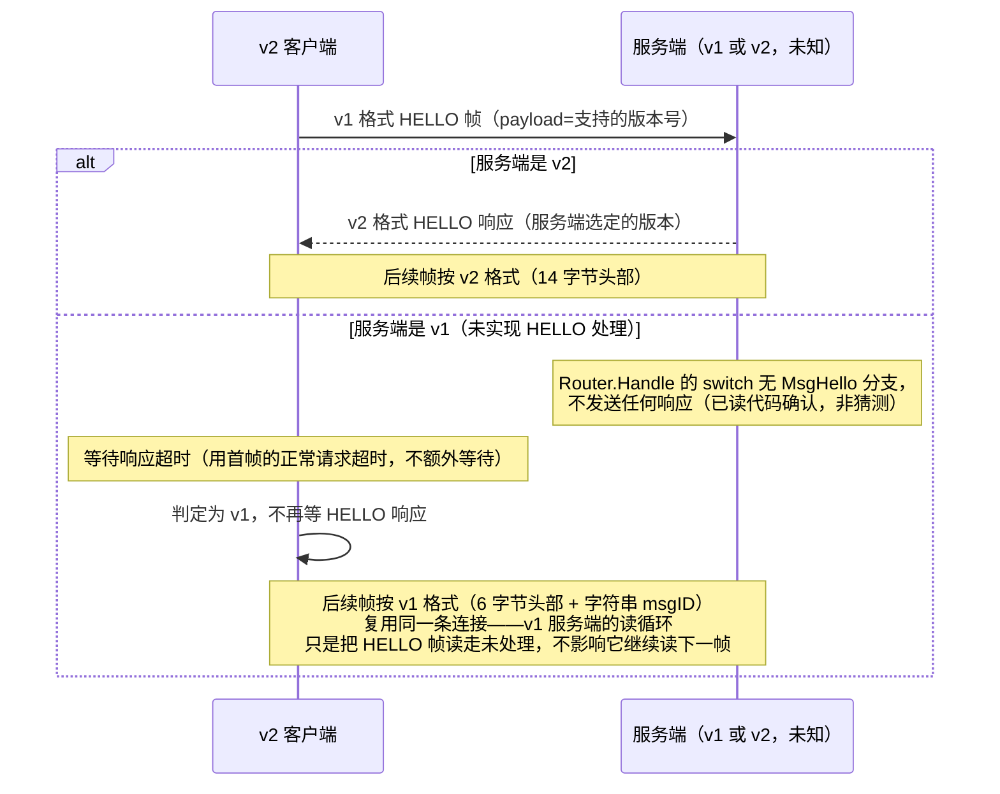

# RFC: BANLV v2

> **状态：草案，仅设计、零代码改动。** 待作者审阅 + 研究 dubbo-go Triple 协议后
> 才定稿动工。本文档不修改 `bannet/`、`client/`、`docs/BANLV-协议规范.md` 里
> 描述的任何 v1 行为——v1 是且仍是当前的生产协议。

## 1. 动机

BANLV v1 一直"够用"，但 QuantScout 用 5241 行真实行情做全量实测这一轮，暴露了
三个都指向同一个根因的语义缺口——**协议本身不知道"这是什么类型的数据"**，
类型是靠 key 前缀事后猜的，猜不准的地方就出错：

1. **响应体没有结构化的错误细节**（对应 D2，见
   `docs/iteration-2026-08-20-quantscout-realdata-fixes.md`）：`dropped` 响应
   本来什么原因都不带，v1.1 用一个追加字段的方式补丁式地塞了 `reason` 进去
   （见 `docs/BANLV-协议规范.md` §3.4）——能用，但只是把本该在协议设计阶段
   就有的结构，事后拿协议扩展的方式补回来。
2. **数据类型不是协议的一等公民，靠 key 前缀猜**（对应 D3）：`dropBackward`
   的单调性检查假设 key 是 `设备:时间戳` 形状，行情快照的
   `quote:<日期>:<代码>` 恰好也能被同一套启发式误读——因为协议本身根本不知道
   这条数据是"行情快照"还是"IMU 帧"，只能靠 `service/ingesthook/schema` 在
   应用层按前缀猜。v1.1 的修法是"已注册 schema 的前缀跳过这项检查"，是对症但
   不治本：只要类型判断还停留在字符串前缀匹配，下一个新类型踩坑只是时间问题。
3. **量纲/字段契约没有协议层的落脚点**（对应 D4）：`volume` 单位是"手"这件事
   现在只能写在 Go 源码注释与建表 DDL 注释里，靠人读文档去对齐——协议帧里没有
   任何位置能声明"这条数据遵循哪个类型契约"，类型契约就只能是纯约定，没有
   协议层的强制力。

这三件事的共同解法是同一个：**把数据类型提升为协议的一等公民**，与
`service/ingesthook/schema` 的注册表对齐（`quote=1` 这样的类型号，直接对应
schema 注册表里的校验器），校验分派、单调性策略都按 `type` 走，不再靠 key
前缀猜。

## 2. 新帧格式

```
[magic+ver u16][flags u8][opcode u8][type u16][corr_id u32][dataLen u32][data bytes]
```

固定头部 14 字节（相比 v1 的 6 字节头部 + 变长 msgID，v2 头部整体变长但是
**定长**——不再有变长的 msgID 字符串，opcode 改成定长数字，见第 3 节）。

| 字段 | 长度 | 说明 |
|---|---|---|
| `magic+ver` | u16 LE | 高字节固定魔数（草案值 `0xBA`，"BanDB" 的缩写谐音），低字节协议版本号（v2 起始值 `0x02`）。存在的意义见 §5 协商流程——v1 帧完全没有这个字段，据此可以从字节层面区分"这是不是 v2 帧"，而不必先解析完整帧才发现版本不对。 |
| `flags` | u8 | 位标志，本轮全部保留未定义。候选用途（**开放问题，见 §7**）：bit0 压缩负载、bit1 流式/分片消息。是否真的做、怎么做，等 dubbo-go Triple 调研结果落地后再定。 |
| `opcode` | u8 | 数字操作码，取代 v1 的字符串 msgID，见 §3 对照表。 |
| `type` | u16 | 数据类型号，与 `service/ingesthook/schema` 的注册表对齐，见 §3。`0` 保留为"未声明类型"（向后兼容语义，见 §6）。 |
| `corr_id` | u32 | 请求关联 ID，客户端赋值、服务端在对应响应里原样带回。解锁流水线——v1 严格"发一帧、收一帧"的限制来自没有办法把响应对应回具体请求；有了 `corr_id`，一条连接上可以有多个在途请求，响应按 `corr_id` 匹配，不必按发送顺序返回。**是否真的做流水线**是本轮的开放问题（见 §7），但字段先留出来。 |
| `dataLen` | u32 LE | 负载长度，与 v1 语义相同。 |

**去掉了变长 msgID**：v1 的 `idLen`+`msgID bytes` 整体被 `opcode`（1 字节数字）
取代。这不是省字节的优化，是"操作码应该是协议定义的枚举，不是运行时字符串"
这个立场的直接后果——字符串 msgID 理论上可以是任意值，数字 opcode 才有真正
意义上的"协议版本内有效值集合"。

## 3. opcode / type 对照表

### 3.1 opcode（数字操作码，取代 v1 字符串 msgID）

高位区分方向：`0x00-0x7F` 是请求，`0x80-0xFF` 是响应。

| opcode | 方向 | 含义 | 对应 v1 msgID |
|---|---|---|---|
| `0x01` | 请求 | PUT | `"PUT"` |
| `0x02` | 请求 | GET | `"GET"` |
| `0x03` | 请求 | DEL | `"DEL"` |
| `0x04` | 请求 | SCAN | `"SCAN"` |
| `0x05` | 请求 | HELLO（版本协商，见 §5） | `"HELLO"`（v1 已声明但零调用方） |
| `0x06` | 请求 | BYE（保留，语义待定） | `"BYE"`（v1 已声明但零调用方） |
| `0x80` | 响应 | OK | `"OK"` |
| `0x81` | 响应 | ERR | `"ERR"` |

v1 的 `HELLO`/`BYE` 是声明但从未实现握手/挥手语义的保留常量（见
`docs/BANLV-协议规范.md` §2）——v2 第一次真正给 `HELLO` 赋予行为（版本协商），
`BYE` 仍然保留但本轮不定义具体语义。

### 3.2 type（数据类型号，与 schema 注册表对齐）

| type | 含义 | 对应 `service/ingesthook/schema` 注册表 |
|---|---|---|
| `0` | 未声明类型（向后兼容默认值，见 §6） | 无——不做类型相关的校验/单调性分派，退化为 v1 行为 |
| `1` | 行情快照（quote） | `quote:` 前缀，`QuoteSnapshot` 校验器 |
| `2+` | 后续新增类型 | 每新增一个 `schema.Register` 的前缀，分配一个 type 号 |

`type` 与 schema 前缀是**多对一或一对一**的映射关系（草案阶段假设一对一，
后续如果同一类型需要多个 key 前缀共享校验规则，可以放宽）。分派规则从
"按 key 前缀最长匹配"改为"按 `type` 字段直接查表"——精确、不需要猜，也
不再受"两种类型的 key 前缀恰好模式相似"这类问题困扰（D3 的根因）。

## 4. 响应体结构化

v1.1 的 `dropped` 响应用追加字段的方式补了 `reason`（见
`docs/BANLV-协议规范.md` §3.4）。v2 把这个补丁转正为正式设计：

```
[opcode=0x80/0x81][type][corr_id][statusCode u16][reasonLen u16][reason][payloadLen u32][payload]
```

（省略了帧头部分，只写响应体的结构；`statusCode` 数字化 v1 的字符串 status，
`payload` 是可选的结构化返回值——GET 的 value、SCAN 的命中集，都归到这个统一
形状里，而不是像 v1 那样每种操作各自定义响应体尾部格式。）

这不是本轮的重点设计，列在这里是为了让 §1 提到的"D2 的补丁转正"有具体落点，
细节（`statusCode` 的枚举值、`payload` 的内部格式）留到定稿阶段再展开。

## 5. 协商流程：复用 HELLO，v1/v2 零破坏共存

**核心思路**：v2 客户端连接后先发一个 v1 格式的 HELLO 帧（用 v1 的
`[dataLen][idLen]["HELLO"][payload=客户端支持的版本]`），根据是否收到响应
判断对端是 v1 还是 v2：



**这一步已经用代码验证过、不是假设**：`service/router.go` 的 `Router.Handle`
switch 语句只有 `MsgPut`/`MsgGet`/`MsgDelete`/`MsgScan` 四个 case，没有
`MsgHello`——v1 服务端收到 HELLO 帧会静默不回应（连接不断开，只是这一帧没有
响应）。这意味着：

- v2 客户端**不能**用"阻塞等 HELLO 响应"的方式做协商——会在 v1 服务端上
  永远等下去。必须用有限超时（建议直接复用该客户端本来就有的单次请求超时），
  超时即判定为 v1，**不视为错误**。
- 复用同一条连接可行的前提是：v1 服务端的读循环（`bannet/connection.go` 的
  `StartReader`）逐帧独立读取、不会因为某一帧没人处理就卡住下一帧的读取——
  这一点已经是 v1 现有实现的行为，v2 协商可以依赖它，不需要额外改 v1。

## 6. 向后兼容矩阵

| 客户端 \ 服务端 | v1 | v2 |
|---|---|---|
| v1 客户端 | 正常（现状） | **需要 v2 服务端保留 v1 帧格式解析能力**（双栈：先按 magic 字节判断，非 v2 magic 则退回 v1 解析路径） |
| v2 客户端 | 依 §5 协商降级为 v1 格式通信，`type` 概念不存在，行为等价于今天 | 正常，`type=0` 时行为等价于 v1（未声明类型，不做类型相关分派） |

**v2 服务端必须双栈**：这是本 RFC 认为不能妥协的一条——协议升级不能要求
所有 v1 客户端同时升级。具体做法（草案）：服务端读到帧头前 2 字节后先判断
是否匹配 v2 magic（`0xBA`）；不匹配则整体按 v1 的 6 字节头部重新解释这两个
字节（v1 头部的前 4 字节是 `dataLen u32`，与 v2 的 `magic+ver u16` 在字节
布局上不冲突，因为它们是两套完全独立的头部结构，服务端在读到这 2 字节时
就已经能分岔，不需要读完整个头部才能判断）。

## 7. 开放问题

- **流水线（`corr_id`）是否真的做**：字段已经留了，但流水线要求客户端连接
  池模型、服务端每连接的响应分发都跟着改（不再是"发一帧等一帧"的简单模型）。
  这是本轮最大的不确定项，等 dubbo-go Triple 协议调研结果作为输入再定。
- **`flags` 的压缩/流式位**：同上，Triple 协议怎么做流式/多路复用是直接的
  参考输入，本轮不预先设计细节，只留位。
- **`payload` 的结构化格式**：§4 提到的响应体结构化，`payload` 内部具体怎么
  编码（是否引入类似 SCAN 响应那种自定义 TLV，还是干脆挪用 JSON）未定。
- **`BYE` 的语义**：本轮只保留 opcode 号位，不定义行为。
- **`type` 号的分配与治理**：是否需要一个中心化的 type 号注册表文档（类似
  gRPC 的 protobuf 字段号治理），避免不同开发者各自新增 schema 时 type 号
  冲突，未定。

## 8. v1 → v2 测试向量迁移方案

`docs/banlv/vectors.json` 当前的 12 条向量全部是 v1 格式，是 Go/Python 两侧
实现共同验证的锚点（见 `docs/BANLV-协议规范.md` §6）。v2 定稿后的迁移方案
（草案）：

1. **不修改现有 12 条向量**——它们验证的是 v1 帧格式，v1 协议本身不变，这些
   向量长期有效。
2. **新增 `docs/banlv/vectors-v2.json`**，独立的向量文件，覆盖 v2 帧格式
   （新头部布局、数字 opcode、`type` 分派、HELLO 协商的请求/响应对）。不
   合并进同一个文件，是因为 v1/v2 是两套完全不同的字节布局，混在一起容易
   在生成脚本里出错、也不便按协议版本分别审阅。
3. **新增 `docs/banlv/vectors-negotiation.json`**（或作为 vectors-v2.json 的
   一个分区）：专门覆盖 §5 协商流程的边界情况——v2 客户端连 v1 服务端超时
   降级、v2 客户端连 v2 服务端协商成功两条路径都要有向量级别的回归锁定，
   不能只在集成测试里测，因为协商失败的后果（连接卡死）比帧解析错误更隐蔽。
4. **Go/Python 两侧的向量测试文件各自新增**（`bannet/vectors_v2_test.go`、
   `client/python/test_bandb_client_v2.py` 或类似命名），与 v1 测试文件并存，
   不合并——两套协议版本的测试意图不同，合并会让测试文件同时承担"锁定 v1
   不变"与"验证 v2 新增"两个不同职责，不利于将来任何一侧单独演进。

本节和全文档一样，是给定稿阶段的起点，不是可以直接照做的实现清单。
