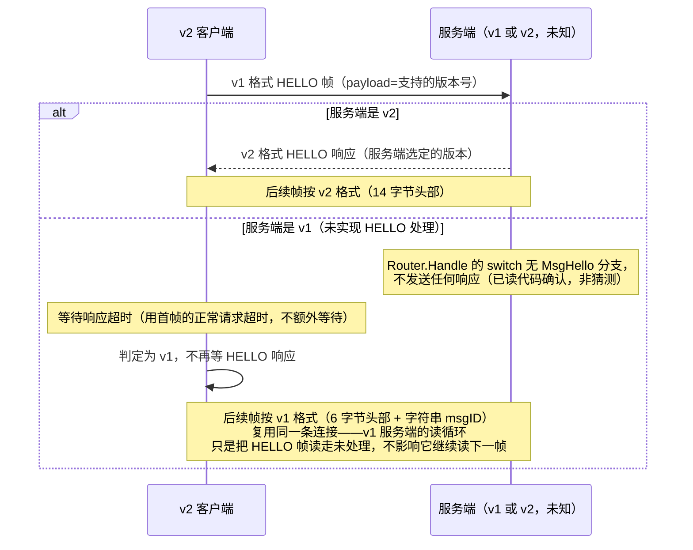

# RFC: BANLV v2

> **状态：草案，仅设计、零代码改动。** 待作者审阅后才定稿动工。本文档不修改
> `bannet/`、`client/`、`docs/BANLV-协议规范.md` 里描述的任何 v1 行为——v1 是且
> 仍是当前的生产协议。
>
> dubbo-go Triple 协议调研已完成（`docs/research/triple-协议调研.md`），结论
> 已折算进 §7 开放问题与 §9/§10 两节新增设计；本轮新增 §9 Schema Descriptor
> 与 §10 机读错误码分类学，均为纯设计，不涉及任何代码改动。

## 1. 动机

BANLV v1 一直"够用"，但 QuantScout 用 5241 行真实行情做全量实测这一轮，暴露了
三个都指向同一个根因的语义缺口——**协议本身不知道"这是什么类型的数据"**，
类型是靠 key 前缀事后猜的，猜不准的地方就出错：

1. **响应体没有结构化的错误细节**（对应 D2，见
   `docs/iteration-2026-08-20-quantscout-realdata-fixes.md`）：`dropped` 响应
   本来什么原因都不带，v1.1 用一个追加字段的方式补丁式地塞了 `reason` 进去
   （见 `docs/BANLV-协议规范.md` §3.4）——能用，但只是把本该在协议设计阶段
   就有的结构，事后拿协议扩展的方式补回来。
2. **数据类型不是协议的一等公民，靠 key 前缀猜**（对应 D3）：`dropBackward`
   的单调性检查假设 key 是 `设备:时间戳` 形状，行情快照的
   `quote:<日期>:<代码>` 恰好也能被同一套启发式误读——因为协议本身根本不知道
   这条数据是"行情快照"还是"IMU 帧"，只能靠 `service/ingesthook/schema` 在
   应用层按前缀猜。v1.1 的修法是"已注册 schema 的前缀跳过这项检查"，是对症但
   不治本：只要类型判断还停留在字符串前缀匹配，下一个新类型踩坑只是时间问题。
3. **量纲/字段契约没有协议层的落脚点**（对应 D4）：`volume` 单位是"手"这件事
   现在只能写在 Go 源码注释与建表 DDL 注释里，靠人读文档去对齐——协议帧里没有
   任何位置能声明"这条数据遵循哪个类型契约"，类型契约就只能是纯约定，没有
   协议层的强制力。

这三件事的共同解法是同一个：**把数据类型提升为协议的一等公民**，与
`service/ingesthook/schema` 的注册表对齐（`quote=1` 这样的类型号，直接对应
schema 注册表里的校验器），校验分派、单调性策略都按 `type` 走，不再靠 key
前缀猜。

## 2. 新帧格式

```
[magic+ver u16][flags u8][opcode u8][type u16][corr_id u32][dataLen u32][data bytes]
```

固定头部 14 字节（相比 v1 的 6 字节头部 + 变长 msgID，v2 头部整体变长但是
**定长**——不再有变长的 msgID 字符串，opcode 改成定长数字，见第 3 节）。

| 字段 | 长度 | 说明 |
|---|---|---|
| `magic+ver` | u16 LE | 高字节固定魔数（草案值 `0xBA`，"BanDB" 的缩写谐音），低字节协议版本号（v2 起始值 `0x02`）。存在的意义见 §5 协商流程——v1 帧完全没有这个字段，据此可以从字节层面区分"这是不是 v2 帧"，而不必先解析完整帧才发现版本不对。 |
| `flags` | u8 | 位标志，本轮全部保留未定义。候选用途（**开放问题，见 §7**）：bit0 压缩负载、bit1 流式/分片消息。是否真的做、怎么做，等 dubbo-go Triple 调研结果落地后再定。 |
| `opcode` | u8 | 数字操作码，取代 v1 的字符串 msgID，见 §3 对照表。 |
| `type` | u16 | 数据类型号，与 `service/ingesthook/schema` 的注册表对齐，见 §3。`0` 保留为"未声明类型"（向后兼容语义，见 §6）。 |
| `corr_id` | u32 | 请求关联 ID，客户端赋值、服务端在对应响应里原样带回。解锁流水线——v1 严格"发一帧、收一帧"的限制来自没有办法把响应对应回具体请求；有了 `corr_id`，一条连接上可以有多个在途请求，响应按 `corr_id` 匹配，不必按发送顺序返回。**是否真的做流水线**是本轮的开放问题（见 §7），但字段先留出来。 |
| `dataLen` | u32 LE | 负载长度，与 v1 语义相同。 |

**去掉了变长 msgID**：v1 的 `idLen`+`msgID bytes` 整体被 `opcode`（1 字节数字）
取代。这不是省字节的优化，是"操作码应该是协议定义的枚举，不是运行时字符串"
这个立场的直接后果——字符串 msgID 理论上可以是任意值，数字 opcode 才有真正
意义上的"协议版本内有效值集合"。

## 3. opcode / type 对照表

### 3.1 opcode（数字操作码，取代 v1 字符串 msgID）

高位区分方向：`0x00-0x7F` 是请求，`0x80-0xFF` 是响应。

| opcode | 方向 | 含义 | 对应 v1 msgID |
|---|---|---|---|
| `0x01` | 请求 | PUT | `"PUT"` |
| `0x02` | 请求 | GET | `"GET"` |
| `0x03` | 请求 | DEL | `"DEL"` |
| `0x04` | 请求 | SCAN | `"SCAN"` |
| `0x05` | 请求 | HELLO（版本协商，见 §5） | `"HELLO"`（v1 已声明但零调用方） |
| `0x06` | 请求 | BYE（保留，语义待定） | `"BYE"`（v1 已声明但零调用方） |
| `0x80` | 响应 | OK | `"OK"` |
| `0x81` | 响应 | ERR | `"ERR"` |

v1 的 `HELLO`/`BYE` 是声明但从未实现握手/挥手语义的保留常量（见
`docs/BANLV-协议规范.md` §2）——v2 第一次真正给 `HELLO` 赋予行为（版本协商），
`BYE` 仍然保留但本轮不定义具体语义。

### 3.2 type（数据类型号，与 schema 注册表对齐）

| type | 含义 | 对应 `service/ingesthook/schema` 注册表 |
|---|---|---|
| `0` | 未声明类型（向后兼容默认值，见 §6） | 无——不做类型相关的校验/单调性分派，退化为 v1 行为 |
| `1` | 行情快照（quote） | `quote:` 前缀，`QuoteSnapshot` 校验器 |
| `2+` | 后续新增类型 | 每新增一个 `schema.Register` 的前缀，分配一个 type 号 |

`type` 与 schema 前缀是**多对一或一对一**的映射关系（草案阶段假设一对一，
后续如果同一类型需要多个 key 前缀共享校验规则，可以放宽）。分派规则从
"按 key 前缀最长匹配"改为"按 `type` 字段直接查表"——精确、不需要猜，也
不再受"两种类型的 key 前缀恰好模式相似"这类问题困扰（D3 的根因）。

## 4. 响应体结构化

v1.1 的 `dropped` 响应用追加字段的方式补了 `reason`（见
`docs/BANLV-协议规范.md` §3.4）。v2 把这个补丁转正为正式设计：

```
[opcode=0x80/0x81][type][corr_id][statusCode u16][reasonLen u16][reason][payloadLen u32][payload]
```

（省略了帧头部分，只写响应体的结构；`statusCode` 数字化 v1 的字符串 status，
`payload` 是可选的结构化返回值——GET 的 value、SCAN 的命中集，都归到这个统一
形状里，而不是像 v1 那样每种操作各自定义响应体尾部格式。）

这不是本轮的重点设计，列在这里是为了让 §1 提到的"D2 的补丁转正"有具体落点，
细节（`statusCode` 的枚举值、`payload` 的内部格式）留到定稿阶段再展开。

## 5. 协商流程：复用 HELLO，v1/v2 零破坏共存

**核心思路**：v2 客户端连接后先发一个 v1 格式的 HELLO 帧（用 v1 的
`[dataLen][idLen]["HELLO"][payload=客户端支持的版本]`），根据是否收到响应
判断对端是 v1 还是 v2：



**这一步已经用代码验证过、不是假设**：`service/router.go` 的 `Router.Handle`
switch 语句只有 `MsgPut`/`MsgGet`/`MsgDelete`/`MsgScan` 四个 case，没有
`MsgHello`——v1 服务端收到 HELLO 帧会静默不回应（连接不断开，只是这一帧没有
响应）。这意味着：

- v2 客户端**不能**用"阻塞等 HELLO 响应"的方式做协商——会在 v1 服务端上
  永远等下去。必须用有限超时（建议直接复用该客户端本来就有的单次请求超时），
  超时即判定为 v1，**不视为错误**。
- 复用同一条连接可行的前提是：v1 服务端的读循环（`bannet/connection.go` 的
  `StartReader`）逐帧独立读取、不会因为某一帧没人处理就卡住下一帧的读取——
  这一点已经是 v1 现有实现的行为，v2 协商可以依赖它，不需要额外改 v1。

## 6. 向后兼容矩阵

| 客户端 \ 服务端 | v1 | v2 |
|---|---|---|
| v1 客户端 | 正常（现状） | **需要 v2 服务端保留 v1 帧格式解析能力**（双栈：先按 magic 字节判断，非 v2 magic 则退回 v1 解析路径） |
| v2 客户端 | 依 §5 协商降级为 v1 格式通信，`type` 概念不存在，行为等价于今天 | 正常，`type=0` 时行为等价于 v1（未声明类型，不做类型相关分派） |

**v2 服务端必须双栈**：这是本 RFC 认为不能妥协的一条——协议升级不能要求
所有 v1 客户端同时升级。具体做法（草案）：服务端读到帧头前 2 字节后先判断
是否匹配 v2 magic（`0xBA`）；不匹配则整体按 v1 的 6 字节头部重新解释这两个
字节（v1 头部的前 4 字节是 `dataLen u32`，与 v2 的 `magic+ver u16` 在字节
布局上不冲突，因为它们是两套完全独立的头部结构，服务端在读到这 2 字节时
就已经能分岔，不需要读完整个头部才能判断）。

## 7. 开放问题（已按 Triple 调研结论更新裁决状态）

- **流水线（`corr_id`）是否真的做**：**仍然开放，未裁决**。Triple 调研
  （`docs/research/triple-协议调研.md` §3）确认了一件事：如果真的要做流式/
  流水线，"长度前缀消息 + 显式流结束信号"是无法绕开的最小结构——这只是
  确认了"要做的话该怎么做"的下限，没有回答"该不该做"。是否做仍取决于
  BANLV 的实际需求（量化数据流目前是批量写入，不是双向流式交互），本轮
  不裁决，留给需求明确后再定。
- **`flags` 的压缩/流式位**：**部分裁决**。Triple 用 HTTP/2 的 `END_STREAM`
  标志表达"流结束"，是流式语义里唯一不可或缺的比特（见调研 §3、§8 裁决表）。
  若 BANLV v2 未来真的做流式，`flags` 应至少留一位给等价的"流结束"语义
  （草案占位：bit1）。压缩位（草案占位：bit0）**调研没有找到 Triple 相关
  的具体设计可供参考**（压缩不是 Triple 强调的设计点），仍然完全开放，
  留待有真实需求（如大负载场景）时单独评估压缩算法选型。
- **`payload` 的结构化格式**：**已裁决方向，细节未定**。Triple 对"错误"与
  "正常返回值"分别用完全不同的模型表达（HTTP/2 trailer vs 消息体），不
  勉强统一（见调研 §4、§8）。BANLV v2 采纳同样的取向：`payload`（正常返回
  值，如 GET 的 value、SCAN 的命中集）与 §10 新增的错误码分类学各自独立
  设计，不强求用一套 TLV 格式同时表达两者。`payload` 内部具体编码格式
  （自定义 TLV vs JSON）仍未定。
- **`BYE` 的语义**：本轮只保留 opcode 号位，不定义行为。Triple 调研未涉及
  连接优雅关闭的等价机制，无相关输入，维持开放。
- **`type` 号的分配与治理**：**仍然开放**。Triple 用 `Service-Name`+方法名
  的字符串路径做服务标识（类似 gRPC 的 `:path`），不是数字化的类型号，
  没有直接可借鉴的"数字类型号治理"先例；调研没有提供新的输入。§9 新增的
  Schema Descriptor 里 `TypeID` 字段的治理问题与此相同，一并留待需要时
  设计一个类似 protobuf 字段号规则的分配规范（如"1-999 保留给核心数据类型、
  1000+ 开放给业务自定义"这类分段策略）。

## 8. v1 → v2 测试向量迁移方案

`docs/banlv/vectors.json` 当前的 12 条向量全部是 v1 格式，是 Go/Python 两侧
实现共同验证的锚点（见 `docs/BANLV-协议规范.md` §6）。v2 定稿后的迁移方案
（草案）：

1. **不修改现有 12 条向量**——它们验证的是 v1 帧格式，v1 协议本身不变，这些
   向量长期有效。
2. **新增 `docs/banlv/vectors-v2.json`**，独立的向量文件，覆盖 v2 帧格式
   （新头部布局、数字 opcode、`type` 分派、HELLO 协商的请求/响应对）。不
   合并进同一个文件，是因为 v1/v2 是两套完全不同的字节布局，混在一起容易
   在生成脚本里出错、也不便按协议版本分别审阅。
3. **新增 `docs/banlv/vectors-negotiation.json`**（或作为 vectors-v2.json 的
   一个分区）：专门覆盖 §5 协商流程的边界情况——v2 客户端连 v1 服务端超时
   降级、v2 客户端连 v2 服务端协商成功两条路径都要有向量级别的回归锁定，
   不能只在集成测试里测，因为协商失败的后果（连接卡死）比帧解析错误更隐蔽。
4. **Go/Python 两侧的向量测试文件各自新增**（`bannet/vectors_v2_test.go`、
   `client/python/test_bandb_client_v2.py` 或类似命名），与 v1 测试文件并存，
   不合并——两套协议版本的测试意图不同，合并会让测试文件同时承担"锁定 v1
   不变"与"验证 v2 新增"两个不同职责，不利于将来任何一侧单独演进。

## 9. Schema Descriptor：类型拥有全部语义

### 9.1 现状：同一个类型的语义散落在四五个不相关的地方

`quote`（行情快照）这一个数据类型，今天的语义分散在：

- **key 布局约定**：`quote:<日期>:<代码>` 只写在 `service/ingesthook/
  schema/quote.go` 的包注释里，是一句自然语言描述，没有任何代码强制它。
- **单调性策略**：`dropBackward` 对已注册 schema 的类型无条件跳过（v1.1 修
  D3 的方式），这个"quote 类型不需要单调性检查"的事实，体现为 filter.go
  里一段 `if hasSchema` 的旁路逻辑，不是 quote 类型自己声明的属性。
- **校验规则**：`QuoteSnapshot.Validate` 方法体，这是唯一一处"结构化"的
  部分（至少是个接口实现）。
- **量纲契约**：`volume` 是"手"这件事，写在 `quoteRecord.Volume` 字段的
  Go 注释里，`docs/clickhouse-schema.md` 的建表 DDL 注释里再抄一遍——两处
  手写、两处都可能各自漂移。
- **错误信息**：`fmt.Errorf("quote: non-positive price: %s=%v", ...)`
  这类临时拼出来的字符串，散落在 `Validate` 方法内部，与 §10 要设计的
  机读错误码毫无关联。
- **投递分区假设**：`quote:<日期>:<代码>` 日期在前这个选择，能让投递按天
  成批、ClickHouse 按月分区——但这个"key 布局与投递策略的关联"这件事，
  目前只存在于人的理解里（体检报告与本 RFC 的动机段落），没有任何代码或
  配置显式声明"这个类型应该怎么投递"。

**六个不同子系统，六份关于同一个类型的、互相不知道对方存在的声明。** 这正是
§1 动机里"数据类型不是协议一等公民"的具体后果——不只是协议帧里没有 `type`
字段，是**代码里也没有一个单一的地方能回答"quote 类型到底是什么"**。

### 9.2 设计：一个类型 = 一份 Schema Descriptor

```go
// 草案接口形状，不是最终 Go 签名——用于表达"一个类型的全部语义在一个地方声明"
// 这个设计意图，定稿时再确定具体字段类型与包结构。
type SchemaDescriptor struct {
    TypeID   uint16 // 对应 §3.2 协议帧里的 type 字段；治理问题见 §7
    Name     string // "quote"

    KeyLayout     KeyLayout     // 声明式的 key 形状，替代"包注释里写一句人话"
    TimeSemantics TimeSemantics // 这个类型要不要单调性检查、检查哪个字段
    Validation    Validator     // 即今天的 schema.Validator 接口，行为不变
    Units         map[string]string // 字段名 -> 量纲，如 {"volume": "lots"}
    ErrorCodes    []ErrorCode   // 见 §10，这个类型的校验器可能产生的机读错误码集合
    DeliveryHint  DeliveryHint  // 分区/去重键提示，供投递层与下游建表参考
}

// KeyLayout 用分隔符+字段名列表声明 key 形状，而不是一句自然语言注释。
// 例：quote 类型 = KeyLayout{Delimiter: ":", Fields: []string{"prefix", "date", "code"}}
type KeyLayout struct {
    Delimiter string
    Fields    []string // 有序字段名，"date"/"code" 这类名字本身即语义
}

// TimeSemantics 声明这个类型是否需要单调性保证，以及哪个 KeyLayout 字段
// 扮演"时间戳"角色——替代 filter.go 里"有没有注册 schema"这个旁路判断。
type TimeSemantics struct {
    Kind      TimeKind // None / StrictlyIncreasing / NonDecreasing
    KeyField  string   // 若 Kind != None，指明 KeyLayout.Fields 里哪个字段是时间戳
}

// DeliveryHint 给投递层的分区/去重建议，不是强制指令——投递层可以选择忽略。
type DeliveryHint struct {
    PartitionByKeyField string   // 例："date"，对应 ClickHouse DDL 的 PARTITION BY
    DedupKeyFields      []string // 例：["code", "date"]，对应 ReplacingMergeTree ORDER BY
}
```

`quote` 类型注册后大致是：

```go
schema.RegisterDescriptor(SchemaDescriptor{
    TypeID: 1,
    Name:   "quote",
    KeyLayout: KeyLayout{Delimiter: ":", Fields: []string{"prefix", "date", "code"}},
    TimeSemantics: TimeSemantics{Kind: None}, // 日频快照允许乱序/重复，不需要单调性
    Validation: QuoteSnapshot{},
    Units: map[string]string{"volume": "lots"},
    ErrorCodes: []ErrorCode{ErrQuoteMissingField, ErrQuoteNonPositivePrice, ...}, // 见 §10
    DeliveryHint: DeliveryHint{PartitionByKeyField: "date", DedupKeyFields: []string{"code", "date"}},
})
```

### 9.3 各子系统如何从 Descriptor 派生行为（而不是各自维护一份）

| 子系统 | 现状 | Descriptor 化之后 |
|---|---|---|
| 协议 `type` 字段分派（§3.2） | 按 key 前缀最长匹配猜 | 直接读 `TypeID`，Descriptor 是唯一真相来源 |
| 落盘前清洗（单调性检查） | `hasSchema` 旁路判断是否跳过 | 读 `TimeSemantics.Kind`，`None` 则跳过，`StrictlyIncreasing`/`NonDecreasing` 则按 `TimeSemantics.KeyField` 指定的字段检查——不再是"有没有注册就跳过"的粗粒度旁路，是每个类型自己声明要不要、查哪个字段 |
| schema 校验 | `Validator.Validate` | 不变，`Validation` 字段就是它 |
| 量纲文档 | 两处手写注释 | `Units` 是唯一声明来源，文档（`docs/clickhouse-schema.md` 之类）应该是从这里生成/引用，不是独立手写第二份 |
| 投递分区 | 人脑理解 + README 的一句话 | 投递层读 `DeliveryHint` 决定批次边界，下游建表脚本可以从 `DeliveryHint` 生成 `PARTITION BY`/`ORDER BY` 建议，不用每个新类型都重新讨论一遍"这个类型该怎么分区" |

### 9.4 与现有代码的关系（不破坏，是重构方向）

`service/ingesthook/schema.Register(prefix, validator)` 这个现有 API 不需要
立刻废弃——`SchemaDescriptor` 可以看作它的超集：`Register` 等价于构造一个
`TimeSemantics.Kind=None`（沿用 v1.1 的"有 schema 就跳过"逻辑）、
`Units`/`ErrorCodes`/`DeliveryHint` 留空的 Descriptor。迁移路径是渐进式的
（新类型直接用 Descriptor 声明全部字段，旧的 `quote` 类型逐步把散落的
量纲注释、错误信息迁移进 Descriptor），不需要一次性重写。

## 10. 机读错误码分类学

### 10.1 现状：字符串是唯一的错误表示

v1.1 的 `reason` 字段（`docs/BANLV-协议规范.md` §3.4）解决了"客户端知道
具体错误"这个问题，但 `reason` 是自由格式的人读字符串
（`"quote: non-positive price: open=-1"`），客户端要做任何程序化处理
（区分"是价格问题"还是"是字段缺失问题"）都得解析字符串前缀——这既脆弱
（字符串措辞一改，客户端的解析逻辑就断），也不是"机读"。

### 10.2 设计：码 + 人读字符串双轨，不是二选一

```
[code u16][reasonLen u16][reason: UTF-8 字符串]
```

`code` 是机读的、跨版本稳定的数字；`reason` 是给人看的、可以随时改措辞的
描述——两者都发，客户端可以只读 `code` 做程序化分支，也可以把 `reason`
原样展示给运维排查，互不冲突。这直接对应 §8 裁决表里 Triple"两套错误模型
服务不同场景、不强求统一"的原则：这里不是要统一成一套，是要**让机器与人
分别有自己够用的表示**。

### 10.3 分类结构：与 A 段修复新增的 metrics 计数器对齐

不凭空设计一套分类，直接对齐这轮 bannet 健壮性审计（见
`docs/iteration-2026-08-20-bannet-robustness-audit.md`）里新增/已有的
`internal/metrics` 计数器——这些计数器已经是这个系统事实上的"错误类目"，
错误码分类学应该是它们的机读化，不是另起一套无关的分类：

| 码段 | 类目 | 对应现有 metrics 计数器 | 说明 |
|---|---|---|---|
| `0x1xxx` | 帧/传输层 | `FramesDroppedMalformed`、`FramesDroppedOversized` | 帧本身有问题（长度不符、超限），与业务类型无关 |
| `0x2xxx` | 时序 | `FramesDroppedNonMonotonic` | 时间戳/单调性问题；具体是否适用取决于 §9 的 `TimeSemantics` |
| `0x3xxx` | schema 校验 | `FramesDroppedSchema` | 每个类型自己的校验失败，子码按 §9 `SchemaDescriptor.ErrorCodes` 分配（如 `0x3001`=quote 缺字段、`0x3002`=quote 非正价格、`0x3003`=quote OHLC 不一致、`0x3004`=quote 涨跌幅超限） |
| `0x9xxx` | 内部 | `PanicsRecovered` | **不通过协议下发给客户端**——这是服务端内部异常，客户端不该看到"服务端刚从一个 panic 里恢复"这种内部细节，只在服务端日志/metrics 里体现；列在这里是为了分类完整性，不是要开一个新的响应路径 |

`0x3xxx` 段的具体子码分配权下放给各 `SchemaDescriptor.ErrorCodes`——这是
`type` 治理问题（§7 仍开放）的一个自然延伸：`type=1`（quote）拥有
`0x3001`-`0x30FF` 这个子区间，`type=2` 拥有下一个区间，以此类推，避免不同
类型的错误码手工分配时互相冲突。具体的区间划分规则本轮不定稿，留给 `type`
号治理方案一并设计。

### 10.4 与 SCAN 状态码的关系（不是替代，是分层）

`proto.StatusOK`/`StatusNotFound` 等 v1 状态字符串（`docs/BANLV-协议规范.md`
§3.4 状态码表）描述的是"这次操作的宏观结果"（成功/查无/过载/服务端错误），
是协议级别的粗粒度状态；`code`（本节）描述的是"如果结果是拒绝，具体因为
什么业务/校验原因"，是更细粒度的补充，两者不冲突、不重叠——`code` 只在
`status=dropped` 这一种宏观状态下才有意义，其余状态（`ok`/`notfound`/
`overloaded`/`error`）不需要、也不应该附带 `code`。

本节和全文档一样，是给定稿阶段的起点，不是可以直接照做的实现清单。
