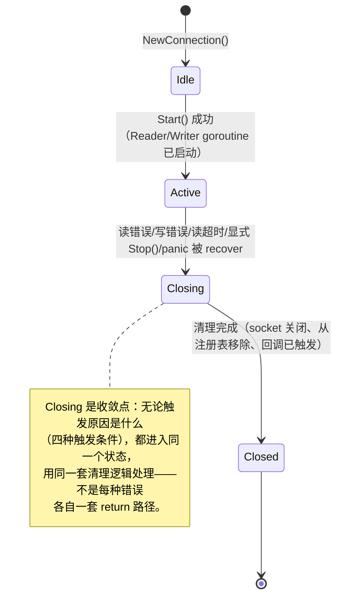
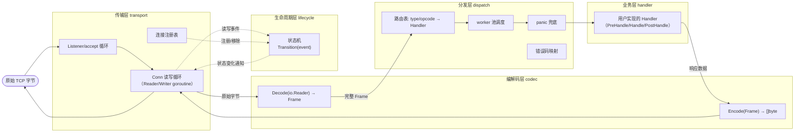
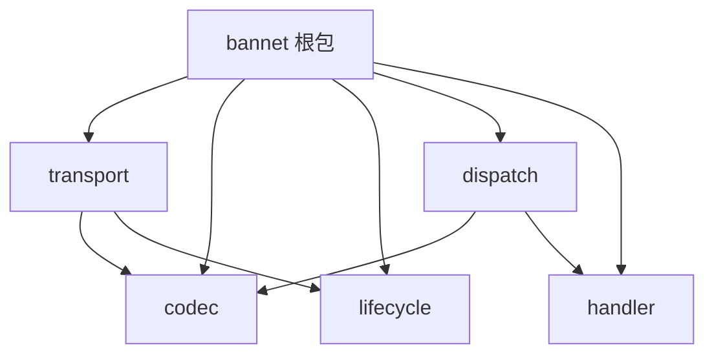

# RFC：bannet 重构——从隐式生命周期到显式分层架构

> **状态：草案，仅设计、零代码改动。** 待作者审阅后才定稿动工。本文档基于
> `docs/research/网络框架生命周期与分层调研.md`（业界调研）与本文 Part B
> 的代码实证审计，融合成 Part C 的重构方案。红线：不生搬任何框架的具体
> 实现，只借鉴设计思想；调研信息源已在调研文档标注，不确定处照实标注，
> 不代入本 RFC 的裁决依据。

## 0. 背景

上一轮 `recover()` 修复（`docs/iteration-2026-08-20-bannet-robustness-audit.md`）
堵住了"一个坏帧/一个业务 bug 打崩整个进程"这个最紧急的口子，但那是止血，
不是治本——`recover()` 只是在错误已经发生之后兜底，没有回答"连接从建立到
关闭，应该经历哪些状态、谁负责在每个状态做什么"这个更根本的问题。本 RFC
是治本的部分：把 bannet 现在隐式的、散落在各个文件里的生命周期管理与职责
边界，重新设计成显式的状态机 + 分层架构。

---

# Part B：bannet 现状审计（代码实证）

## B.1 现状目录树：职责与行数标注

```
bannet/
├── interfaces.go     65 行   全部跨层接口定义在一个文件（ConnRegistry/Codec/
│                             Dispatcher/Request/Handler/Conn 六个接口）
├── message.go         41 行   帧数据模型（Message 结构体 + getter/setter）
├── request.go          32 行   Request 接口的默认实现（包装 Message + Conn）
├── router.go           13 行   Handler 接口的默认实现（BaseRouter，三个空方法）
├── datapack.go         63 行   编解码：DataPack.Pack/UnPack——但 UnPack 只解 6
│                             字节定长头部，不解完整帧（见 B.3 的分层裂缝）
├── conn_manager.go     66 行   连接注册表（fd/connID → Conn 的 map + 锁）
│
├── connection.go      306 行  ⚠️ 职责混装：见 B.1.1
├── msghandle.go       130 行  ⚠️ 职责混装：见 B.1.2
├── server.go          169 行  ⚠️ 职责混装：见 B.1.3
│
└── *_test.go          （8 个测试文件，共约 940 行，不在本次审计范围）
```

非测试代码共 885 行，9 个文件；其中 3 个文件（`connection.go`/`msghandle.go`/
`server.go`，合计 605 行，占非测试代码的 68%）职责混装，是架构问题的物理
集中地——不是"到处都有一点问题"，是"问题几乎全部集中在这三个文件里"。

### B.1.1 `connection.go`（306 行）：一个文件干了四层的活

| 函数 | 实际所属层 |
|---|---|
| `NewConnection`、`StartReader`、`StartWriter`、`write`、`TCPConn`、`RemoteAddr` | **传输层**：原始字节收发 |
| `StartReader` 内部：先调 `dp.UnPack(headData)` 解头部，再手工读 `idLen` 字节、读 `dataLen` 字节 | **编解码层**（但被拉进了传输层的循环里，`datapack.go` 只做了一半的事，见 B.3） |
| `Start`、`Stop`、`ctx`/`cancel`/`stopOnce`、`recoverConnGoroutine` | **生命周期层**（隐式，没有独立状态概念，见 B.2） |
| `StartReader` 内部：`if c.useWorkerPool { SendMsgToTaskQueue } else { go DoMsgHandle }` 的分派决策 | **分发层**（决定"怎么把解出来的请求交给谁处理"，本该是 dispatch 的职责，却写在 transport 的读循环里） |
| `SendMsg`、`SendBuffMsg` | 业务 handler 调用的对外契约（响应发送 API），与上面四类混在同一个 struct 上 |
| `SetProperty`/`Property`/`RemoveProperty` | 与 I/O 完全无关的旁挂 key-value 存储 |

一个 `Connection` 结构体同时是：socket 包装器、（半个）帧组装器、生命周期
管理者、分发决策者、响应发送 API、外加一个通用属性袋——六种职责压缩进一个
306 行的文件。

### B.1.2 `msghandle.go`（130 行）：这正是被点名的"是不是什么都干"

| 函数 | 实际所属层 |
|---|---|
| `routers map[string]Handler`、`AddRouter` | 路由表（分发层核心职责之一） |
| `DoMsgHandle`（含 `recover`） | 分发执行 + 故障隔离 |
| `StartWorkerPool`、`SendMsgToTaskQueue`、`StartOneWorker`、`Stop` | worker 池调度（并发资源管理，与"路由到哪个 Handler"是完全不同的关注点——一个是"分给谁处理"，一个是"用什么并发策略执行"） |

`MsgHandle` 这一个类型同时是：路由表、请求分派器、worker 池调度器——三种
关注点合并在同一个结构体里，`SendMsgToTaskQueue` 里的 work-stealing 逻辑
（尝试专属队列 → 轮询其它队列 → 阻塞等待）与 `AddRouter` 的路由注册没有
任何依赖关系，纯粹是因为"都归 MsgHandle 管"才写在一起。

### B.1.3 `server.go`（169 行）：传输 + 准入 + 进程生命周期 + 回调注册

| 函数 | 实际所属层 |
|---|---|
| `Start`、`acceptLoop`（含新加的退避逻辑） | 传输层：监听与接受连接 |
| `acceptLoop` 内部：`if s.ConnMgr.Len() >= config.G.MaxConn` | 准入策略（业务/资源治理决策，嵌在传输层的接受循环里） |
| `Serve`（`signal.Notify` + 阻塞等 SIGINT/SIGTERM） | 进程级生命周期，与"单个连接的生命周期"是不同的抽象层次，但两者都叫"生命周期"容易混淆 |
| `SetConnStartFunc`/`SetConnStopFunc`/`CallConnStartFunc`/`CallConnStopFunc` | 连接生命周期事件的回调注册与触发——这本该是 B.2 提到的"生命周期层"的职责，却挂在 `Server`（传输层门面）上 |
| `AddRouter` | 直接转发给 `MsgHandle.AddRouter`，`Server` 在这里只是个转发壳，但转发壳的存在让"路由到底归 Server 管还是归 MsgHandle 管"这个问题变得模糊 |

## B.2 生命周期现状：隐式，靠 `defer`+`return`+`sync.Once` 收敛，没有可查询的状态

**核心问题**：现在没有任何地方能回答"这个连接现在处于什么状态"这个问题。
"状态"只存在于一堆副作用的组合里——`ctx` 有没有被 cancel、socket 能不能
读写、`stopOnce` 有没有被消耗——没有一个字段是"当前状态"的单一真相来源。

逐场景过一遍现状实际走的路径：

- **对端正常断连**：`io.ReadFull` 返回 `io.EOF`，`StartReader` 的 `defer
  c.Stop()` 触发，`stopOnce.Do` 里做 `cancel()`+`Conn.Close()`+回调+从
  `ConnManager` 移除。全靠 `return` 语句的位置隐式表达"这是终止路径"。
- **读超时**（本轮刚加）：`SetReadDeadline` 到期，`io.ReadFull` 返回一个
  `net.Error` 且 `Timeout()==true`，处理路径与"对端断连"完全相同——两种
  性质不同的终止原因（"对端主动挂断" vs "我们主动放弃这个不配合的连接"）
  在代码里走的是同一条 `return`，没有区分。
- **半关闭**：BANLV 协议本身没有半关闭语义（不像 TCP 本身支持
  `shutdown(fd, SHUT_WR)`），`Connection` 也没有对半关闭做任何特殊处理——
  一旦读方向出错就直接整体 `Stop()`，即使写方向可能还是好的。这不算一个
  "缺陷"（协议没这个语义，处理起来自然没有），但值得在重构时明确写下来：
  **这是一个当前协议边界带来的简化，不是遗漏**。
- **优雅关闭**（`Server.Stop()`）：`ConnMgr.ClearConn()` 遍历所有连接逐个调
  `conn.Stop()`——这是"强制关闭"，不是"等在途请求处理完再关"。一个正在
  `DoMsgHandle` 里执行业务逻辑的请求，会在 `Stop()` 把 `ctx` cancel 之后
  继续跑完（`DoMsgHandle` 不看 `ctx`），但它的响应可能因为连接已经被关闭
  而发不出去——**这是一个真实的竞态窗口**：优雅关闭没有"等待在途请求排空"
  这个阶段，只有"立刻掐断连接"。

**状态泄漏的一个具体例子**：`Connection.Stop()` 用 `stopOnce.Do` 保证幂等，
但这只保证"清理动作只做一次"，不保证"想查询这个连接是否已经进入关闭流程"
这件事有地方可查——目前只能通过"能不能成功 `SendMsg`"这种side effect 去
推断，`errConnClosed` 这个哨兵错误就是这种"用副作用反推状态"模式的直接
产物。

## B.3 分层现状：编解码层没有完整承担编解码职责

`datapack.go` 的 `UnPack` 只解析 6 字节定长头部，注释里明确写着"调用方
拿到 IDLen 后，还需要从连接读取 IDLen+DataLen 字节填充 Id 与 Data"——
也就是说**帧组装的后半段（读 msgID、读负载）不在编解码层，被拉到了
`connection.go` 的 `StartReader` 循环里**。这不是随手的实现细节，是分层
边界本身就没有画完整：`Codec` 接口只覆盖了"解头部"，没有覆盖"组装出一个
完整可用的 Frame"，导致本该属于编解码层的逻辑，有一半留在了传输层。

## B.4 goroutine 所有权现状

| goroutine | 谁创建 | 谁负责回收 | 通知停止的机制 |
|---|---|---|---|
| `StartReader`（每连接一个） | `Connection.Start()` | 自己在 `defer c.Stop()` 里触发连接清理，但goroutine 本身的退出是靠函数 `return`——没有外部信号能主动喊停它，只能等它自己读到错误/超时/panic | 无主动通知：`Stop()` 关闭 socket 来间接打断阻塞的 `io.ReadFull`，是"迂回打断"而非"直接通知" |
| `StartWriter`（每连接一个） | `Connection.Start()` | 同上，靠 `select { case <-c.ctx.Done(): return ...}` | **有**主动通知：监听 `ctx.Done()`，这是四类 goroutine 里唯一一个真正响应显式取消信号的 |
| worker 池 goroutine（`StartOneWorker`，数量 = `WorkerPoolSize`，常驻） | `MsgHandle.StartWorkerPool()`，服务端启动时一次性创建，与任何单个连接无关 | `MsgHandle.Stop()` 逐个 `close(taskQueues[i])`，`for range` 自然退出 | 有序关闭，但触发时机绑定在 `Server.Stop()` 上，与"单个连接关闭"完全脱钩——**这是对的**（worker 池是全局资源，不该跟着某个连接的生死走），但也说明"连接级 goroutine"与"进程级 goroutine"目前只是靠人脑记住"这两类不一样"，没有代码层面的显式区分 |
| `go c.MsgHandle.DoMsgHandle(req)`（`useWorkerPool=false` 时，每帧一个新 goroutine） | `StartReader` 每次成功解出一帧就创建 | 自己跑完 `DoMsgHandle` 就退出，无人追踪 | **无追踪、无通知机制**——这类 goroutine 数量不设上限，是本轮"panic 会拖垮整个进程"之外，另一个尚未解决的问题：一个恶意/异常客户端能以任意速率发送合法帧，逼出任意数量的一次性 goroutine，是潜在的 goroutine 数量爆炸风险（不是本轮 recover 修复解决的范畴，留给本次重构评估） |

**结论**：四类 goroutine 里，只有 `StartWriter` 真正用 `ctx.Done()` 做了
显式的"收到通知就退出"；`StartReader` 靠"打断阻塞调用"这种迂回方式；
worker 池靠 channel 关闭；`go DoMsgHandle` 完全没有生命周期追踪。**没有
一个统一的"goroutine 归属于哪个对象、由谁在关闭时通知它"的模型**，四种
goroutine 各自采用了不同的、偶然形成的退出方式。

---

# Part C：重构 RFC

## C.1 显式连接生命周期状态机



| 状态 | 含义 | 谁能查询 |
|---|---|---|
| `Idle` | 已构造，尚未启动收发 goroutine | `Lifecycle.State()` |
| `Active` | 正常收发中 | 同上 |
| `Closing` | 已决定关闭，清理进行中（幂等，可能被多个触发源并发进入，但只执行一次实际清理） | 同上 |
| `Closed` | 清理完成，资源已释放 | 同上 |

**与现状的关键差异**：现状里"进入关闭流程的原因"（EOF/超时/显式
Stop/panic）各自散落在不同的 `return` 语句里，靠代码位置隐式表达；重构后
四种原因都归约成同一个 `Transition(event)` 调用，状态机内部统一处理"决定
收敛到 Closing"这一步，`event` 参数携带原因（供日志/metrics 区分，但不
改变状态机的收敛路径）。**优雅关闭的"等待在途请求排空"**这个 B.2 指出的
缺口，在状态机模型下有了自然的落点：`Active → Closing` 转换时可以选择
"先标记为 draining（拒绝新请求、但允许已分派的请求跑完），再真正转到
Closing"——这是否要做、做到什么粒度，留给定稿阶段结合优雅关闭的实际需求
决定，本轮只指出状态机让这件事"有地方可以做"，不代表本轮就要做。

## C.2 分层架构



- **传输层**只认字节，不认 msgID/type/Handler——它的职责边界是"可靠地把
  字节收上来、把字节发出去"，往上只交付"这是一段完整可用的原始数据"。
- **编解码层**只认字节 ↔ Frame 的转换，不知道 Frame 里的内容该交给谁处理——
  这一层完整吸收 B.3 指出的裂缝（`Decode` 直接产出组装完整的 Frame，不再
  是"解个头部，剩下的调用方自己读"）。
- **生命周期层**独立于传输层的具体 I/O 细节，只认"事件 → 状态转换"这一件
  事，传输层的错误/超时/关闭请求都翻译成"事件"喂给它，不直接操作状态。
- **分发层**吸收 `msghandle.go` 现在的全部职责（路由、worker 池、panic
  隔离），新增错误码映射（见 C.6）。
- **业务层**就是今天的 `Handler` 接口，边界不变——这是用户实际要实现的
  唯一契约，重构不应该让这一层变得更复杂。

这个分层与 Netty 的 pipeline 思想同构（数据单向流过传输→编解码→业务，
错误/生命周期事件独立于数据流），但**不采用 Netty 的责任链/
ChannelHandlerContext 模式**——那是给"一条流水线上可插拔、可重排多个
handler"设计的机制，bannet 的分发逻辑是"按 type/opcode 查表分发到唯一一个
Handler"，不需要责任链的双向遍历能力，Go 惯用法下用清晰的包边界 + 接口
就能表达同样的层次隔离，不必引入责任链对象模型。

## C.3 goroutine 所有权模型

| goroutine | 归属对象 | 创建时机 | 终止信号 | 等待确认方式 |
|---|---|---|---|---|
| `transport.Conn` 读循环 | 该 `Conn` 实例（生命周期层的 `Lifecycle` 对象） | `Lifecycle` 转入 `Active` 时 | `Lifecycle.Done()`（等价于现状的 `ctx.Done()`，但由状态机统一持有，不是 `Connection` 自己管） | 无需等待——它自己观察到 I/O 错误/超时会主动上报事件给 `Lifecycle`，不依赖外部等待其退出 |
| `transport.Conn` 写循环 | 同上 | 同上 | 同上 | 同上 |
| 分发层 worker 池 goroutine | `dispatch.Pool`（进程级，与任何单个连接无关） | 服务启动时一次性创建 | `dispatch.Pool` 关闭其内部 channel | `Server.Stop()` 阶段可选：用类似 Tokio `TaskTracker` 的模式（一个计数器/`sync.WaitGroup`）等所有 worker 排空当前队列再返回，取代现状"关 channel 就不管了"的做法 |
| 单帧临时分派 goroutine（`useWorkerPool=false` 时） | **重构后不再存在**：分发层统一走 worker 池（哪怕 `WorkerPoolSize` 配置成"退化模式"，也应该是池子里一个专门的"直接执行"策略，不是绕过池子另起一次性 goroutine）——直接解决 B.4 指出的"无追踪、无通知机制"问题，不是给它补一个通知机制，是不让这类 goroutine 存在 |

**关闭传播机制**：借鉴调研 §4（Tokio）的两段式模型，不照抄 `CancellationToken`
/`TaskTracker` 的具体类型，用 Go 惯用的 `context.Context`（对应"广播取消
意图"）+ 一个显式的等待原语（`sync.WaitGroup` 或等价物，对应"确认都已完成"）
组合表达：

1. **广播**：`Lifecycle.Transition(EventShutdown)` 或 `dispatch.Pool.Shutdown()`
   触发时，通过各自持有的 `context.CancelFunc` 广播取消意图。
2. **等待**：调用方（`Server.Stop()`）持有一个能等待"确认都已收尾"的原语，
   不是发完取消信号就假定已经结束——这是现状 `ClearConn()` 缺的那一步
   （B.2 指出的竞态窗口），重构后应补上。

## C.4 目标包结构

### C.4.1 目标目录树

```
bannet/
├── codec/               编解码层：Frame 定义、Decode/Encode、v1/v2 帧格式共存
│   ├── frame.go           Frame 结构体（取代 message.go，含 v2 的 Type 字段占位）
│   ├── v1.go               BANLV v1 编解码（datapack.go 的 Pack/UnPack + 现在
│   │                       在 connection.go 里的 idLen/data 读取，合并到一处）
│   └── limits.go           帧长上限策略（hardMaxPackageSize 等，从 connection.go 移入）
│
├── lifecycle/             生命周期层：状态机，不认字节、不认业务
│   └── state.go            State 枚举、Transition、Done()
│
├── transport/             传输层：只认字节收发
│   ├── listener.go         acceptLoop、MaxConn 准入（server.go 的对应部分）
│   ├── conn.go              Conn 读写循环（connection.go 剥离掉分发/生命周期/
│   │                       property 之后剩下的部分）
│   └── registry.go          连接注册表（conn_manager.go 直接移入，接口不变）
│
├── dispatch/              分发层：路由 + worker 池 + panic 隔离 + 错误码
│   ├── router.go            路由表（type/opcode → Handler），含 §9 Schema
│   │                       Descriptor 的注册点（见 C.6）
│   ├── pool.go              worker 池调度（msghandle.go 的 StartWorkerPool/
│   │                       SendMsgToTaskQueue/StartOneWorker）
│   └── errors.go            机读错误码映射（§10 taxonomy 的落地点，见 C.6）
│
├── handler/               业务层契约：对外扩展面，改动最小
│   └── handler.go           Handler 接口、BaseRouter、HookAction（interfaces.go
│                           与 router.go 的对应部分）
│
└── bannet.go              根包：组合门面，保留现有公开 API
                           （NewServer/AddRouter/Start/Stop/Serve 签名不变，
                           内部委托给上面五个子包；Conn/Request/Handler 等
                           跨层类型在这里重导出，外部调用方无需改 import 路径）
```

### C.4.2 依赖方向图（单向，可用 `go list` 验证无环）



`transport` 与 `dispatch` 是兄弟关系——都依赖 `codec`，互相不依赖，只在
根包里被组合到一起（根包用回调/channel 把 transport 解出来的 Frame 转交
给 dispatch，而不是让 transport 直接 import dispatch）。这个"兄弟层只能
通过根包协调，不能互相 import"的约束，与 QuantBrew 的 crate 边界纪律
同构——**架构约束靠 Go 编译器的包边界强制执行，不是靠代码审查时"记得
检查一下"**：一旦有人尝试让 `transport` 直接 import `dispatch`，`go
build` 层面就能看出这是一个新增的、违反设计的依赖，不需要人工巡查
import 语句。定稿后应该有一个简单的 CI 检查（如 `go list -deps` 输出
比对）固化这条规则，防止后续悄悄破坏分层。

### C.4.3 现状树 vs 目标树 并排对照

```
现状（885 行，9 文件，3 个文件跨 4 层）      目标（职责与文件一一对应）
bannet/                                    bannet/
├── interfaces.go  (6 个接口混一起)          ├── codec/       (Frame + 编解码)
├── message.go                              ├── lifecycle/   (状态机)
├── request.go                              ├── transport/   (I/O + 注册表)
├── router.go                               ├── dispatch/    (路由+池+错误码)
├── datapack.go    (只解头部)                 ├── handler/     (业务契约)
├── conn_manager.go                          └── bannet.go    (门面，API 不变)
├── connection.go  ⚠️ 4 层混装
├── msghandle.go   ⚠️ 3 层混装
└── server.go      ⚠️ 4 层混装
```

## C.5 迁移映射表

| 现状文件/函数 | 目标包 | 迁移类型 |
|---|---|---|
| `datapack.go`（`Pack`/`HeadLen`） | `codec` | 直接移动 |
| `datapack.go`（`UnPack`） | `codec` | **需重写**：从"只解头部"扩展为"给 `io.Reader`，吐一个完整 `Frame`"，吸收下面这条 |
| `connection.go` 的 `StartReader` 里手工读 `idLen`/`data` 的部分 | `codec` | **需拆分**：这段逻辑离开 `connection.go`，并入 `codec.Decode` |
| `message.go`（`Message` 结构体与方法） | `codec` | 直接移动，可能改名为 `Frame`（含 v2 的 `Type` 字段） |
| `connection.go` 的 `effectiveMaxPackageSize`/`hardMaxPackageSize` | `codec`（限制策略与"解出多大的帧才算合法"是编解码层该管的事） | 直接移动 |
| `connection.go` 的 `ctx`/`cancel`/`stopOnce`/`recoverConnGoroutine` | `lifecycle` | **需重写**为显式状态机（C.1），不再是裸 `context`+`sync.Once` 的组合 |
| `connection.go` 的 `StartReader`/`StartWriter` 主循环（剥离编解码与生命周期部分后剩下的 I/O 编排） | `transport` | 直接移动，改为消费 `codec.Decode`/驱动 `lifecycle.Transition` |
| `connection.go` 的 `SendMsg`/`SendBuffMsg`/`write` | `transport` | 直接移动 |
| `connection.go` 的 `SetProperty`/`Property`/`RemoveProperty` | 待定（可留 `transport.Conn` 上，或拆到独立最小接口） | **需评估**：与 I/O 无关的旁挂状态，本轮不强制拆分，标记为后续可选项 |
| `connection.go` 的 `StartReader` 里"分派给 worker 池还是直接起 goroutine"的判断 | `dispatch` | **需拆分**：这个决策权本该在 dispatch，不在 transport |
| `msghandle.go` 全部（`routers`/`AddRouter`/`DoMsgHandle`/`StartWorkerPool`/`SendMsgToTaskQueue`/`StartOneWorker`/`Stop`） | `dispatch` | 直接移动，`DoMsgHandle` 的 `recover` 保留在这一层，新增 §10 错误码映射（新职责） |
| `server.go` 的 `acceptLoop`/`Start`/退避逻辑 | `transport` | 直接移动 |
| `server.go` 的 `MaxConn` 准入判断 | `transport` | 直接移动（准入仍是接受连接这一步该做的事，只是现在挂在正确的包里） |
| `server.go` 的 `Serve`（信号处理） | `bannet` 根包 | 保留在根包——这是进程级编排，不属于任何单一层 |
| `server.go` 的 `SetConnStartFunc`/`SetConnStopFunc`/`CallConnStartFunc`/`CallConnStopFunc` | `lifecycle` | **需拆分**：连接建立/关闭回调是生命周期事件的挂载点，`Server` 只做注册转发 |
| `conn_manager.go` 全部 | `transport` | 直接移动，接口不变 |
| `interfaces.go`（`Codec`） | `codec` | 直接移动 |
| `interfaces.go`（`ConnRegistry`、`Conn`） | `transport` | 直接移动 |
| `interfaces.go`（`Dispatcher`） | `dispatch` | 直接移动 |
| `interfaces.go`（`Request`、`Handler`、`HookAction`） | `handler` | 直接移动 |
| `router.go`（`BaseRouter`） | `handler` | 直接移动 |
| `request.go`（`request` 结构体） | `dispatch` | 直接移动（它是"已解码帧 + 连接引用"的分派单元，归属分发层） |

## C.6 协议优化点接入：不为 v2/Schema Descriptor 打洞

- **BANLV v2 的 `type u16` 字段** → 落在 `codec` 层：`Frame` 结构体新增
  `Type` 字段，`codec.Decode` 按 v2 帧格式解析时一并解出，`codec` 对外的
  契约不变（"给字节，吐 Frame"），只是 Frame 的内容变丰富，`dispatch` 消费
  `Frame.Type` 做路由查表——不需要为 v2 单独开一层，`codec` 早就是"解析
  协议字节"的正确落点。
- **§10 机读错误码分类学** → 落在 `dispatch` 层：`dispatch.errors.go` 是
  "判断请求是否该被拒绝、拒绝时给出什么错误码"的地方，这本来就是
  `DoMsgHandle`（分发执行）该做的决策，错误码只是让这个决策的结果变得
  机读，不改变它的归属层。
- **§9 Schema Descriptor** → 注册点落在 `dispatch.router`：今天的
  `schema.Register(prefix, validator)` 是按 key 前缀猜类型，重构后
  `dispatch.router` 按 `Frame.Type`（协议字段，不再靠猜）查到对应的
  `SchemaDescriptor`，`TimeSemantics`/`Validation`/`ErrorCodes` 都是
  `dispatch` 在处理一条请求时依次读取的字段——不需要新增第七层，Schema
  Descriptor 就是 dispatch 路由表的表项内容变丰富了。

三者都不需要在 C.4 的五层之外新增任何一层——这是分层设计本身是否"留有
余地"的直接检验：一个只考虑了今天需求的分层，遇到 v2/Schema Descriptor
这种明确已知即将到来的需求就会被迫打洞；C.4 的分层在设计时已经把这两个
需求的落点算进去了。

## C.7 迁移策略：渐进式，按包拆分顺序执行，每步独立验证

**不推倒重写**。建议顺序（从"外部依赖最少"到"外部依赖最多"，让每一步的
改动半径最小）：

1. **拆 `codec`**：把 `datapack.go`/`message.go` 移入，同时把
   `connection.go` 里手工读 `idLen`/`data` 的逻辑合并进 `codec.Decode`。
   验证：`bannet` 根包对外行为完全不变（`NewDataPack`/`NewMessage` 等
   现有调用点全部通过根包重导出），跑通现有全部测试（含本轮新增的
   fuzz/malformed-frame 测试）。这一步改动范围最小，因为 `codec` 目前
   没有任何反向依赖。
2. **拆 `handler`**：`interfaces.go`/`router.go` 里业务契约部分移入。
   验证同上——这一步纯粹是接口定义挪位置，不涉及任何运行时行为改动。
3. **拆 `dispatch`**：`msghandle.go` 整体移入，`connection.go` 里"分派给
   worker 池还是直接起 goroutine"的判断移入（同时按 C.3 去掉"单帧临时
   goroutine"这条路径，改为 worker 池的一种调度策略）。验证：并发压测
   数字不应劣化（对照本轮 README 记录的基准：50 并发下 GET 13-18 万
   QPS），且 `service/router.go` 等使用方无需改动 import 路径。
4. **拆 `lifecycle`**：把 `connection.go` 的 `ctx`/`cancel`/`stopOnce`
   重写为显式状态机，`server.go` 的连接回调注册迁入。验证：C.1 描述的
   四种收敛路径（EOF/超时/显式 Stop/panic）逐个跑一遍本轮已有的
   `malformed_frame_test.go`/`panic_recovery_test.go`，断言状态机最终都
   收敛到 `Closed`。
5. **拆 `transport`**：`connection.go`/`server.go`/`conn_manager.go` 剩下
   的部分移入，这是最后一步，因为它依赖前四步都已就位（`codec`/
   `lifecycle`/`dispatch` 的接口边界稳定之后，`transport` 才知道该对接
   什么）。验证：全量回归 + 一次真实的 `cmd/ban-server` 启动/压测/优雅
   关闭手工验证。

每一步结束时，`bannet` 根包对外 API（`NewServer`/`AddRouter`/`Start`/
`Stop`/`Serve`/`Conn`/`Request`/`Handler` 等类型与函数签名）保持不变——
这是"渐进式"的关键约束：**任何一步做完，`cmd/ban-server`、
`service/router.go`、`client/wire_compat_test.go` 等现有调用方都不需要
改一行代码**，重构对它们是透明的，可以在任意一步之间暂停、评估，不存在
"必须一次做完否则代码编译不过"的压力。

## C.8 明确权衡：事件驱动（gnet 式）vs goroutine-per-connection（现状）——用数字论证

**结论先行：不换并发范式，继续 goroutine-per-connection，只把它显式化/
分层化（C.1-C.5 的内容）。** 理由是负载形状不匹配，不是"事件驱动不好"。

事件驱动模型（gnet/netpoll）要解决的问题，调研 §1、§2 说得很清楚：**海量
并发连接**下，goroutine-per-connection 的每连接调度开销累积起来才会成为
瓶颈——这类框架的典型场景是"数万到数十万个并发的短连接/长轮询客户端"
（如 IoT 设备直连、公网 API 网关）。

BanDB 承接的量化数据流是完全不同的负载形状：

- **连接数**：QuantScout 是单一/少量爬虫进程，通过 `client.Client` 的
  连接池（默认 `PoolSize=8`）接入，即便算上未来可能的分析查询客户端，
  并发连接数量级是**个位数到低两位数**，不是数万。`config.G.MaxConn`
  默认上限是 1000，即便打满这个上限，1000 个连接 × 2 个 goroutine =
  2000 个 goroutine，每个 goroutine 最小栈约 2-8KB，总计几 MB 到十几
  MB 内存——在任何现代服务器上都不构成压力。
- **数据量增长体现在吞吐，不是连接数**：今天 5241 行/天、未来"分钟级
  百万行/天"，这个增长是"同样几个连接上跑更多数据"，不是"接入更多
  连接"——事件驱动模型解决的恰恰是"连接数"这个维度的问题，而 BanDB
  的负载增长压根不在这个维度上。
- **已有实测数据**：README 记录的 BANLV 基准是 50 并发下 GET
  13 万-18.7 万 QPS——**这个数字本身就是在 goroutine-per-connection
  模型下跑出来的**，说明现状架构在远超今天实际负载（个位数并发连接）
  的测试条件下依然远没有触及瓶颈，换成事件驱动模型是在为一个尚未出现、
  也没有证据会出现的问题找解法。

**什么条件下这个结论需要重新评估**：如果未来 BanDB 的接入模式变成
"成千上万个短连接客户端各自零星写入"（而不是今天"少数长连接、持续高吞吐"
这种形状），比如每个个体交易者的终端都直连 BanDB，而不是通过一个集中的
QuantScout 爬虫——那时候连接数量级会真正进入事件驱动模型的适用区间，
需要重新做这个权衡。本轮没有看到这个接入模式转变的迹象，故不预先为它
改架构。

---

## 附：本 RFC 与其它文档的关系

- 调研依据：`docs/research/网络框架生命周期与分层调研.md`
- 与 `docs/rfc/BANLV-2.md` 的关系：BANLV-2 是**协议帧格式**的重新设计
  （v1→v2 的字节布局），本 RFC 是**bannet 内部架构**的重新设计（同一套
  协议之下，代码怎么组织）——两者独立但互相兼容，C.6 已说明 v2 的
  `type` 字段与错误码如何落进本 RFC 的分层里，不需要两份 RFC 协调出
  额外的设计。
- 与本轮 `recover()` 修复的关系：本 RFC 的 `dispatch` 层直接继承
  `DoMsgHandle` 现有的 `recover` 逻辑（`docs/iteration-2026-08-20-
  bannet-robustness-audit.md`），不是推翻重做，是把已经验证有效的止血
  措施安放进一个有显式边界的层里。

本文档和其它 RFC 一样，是给定稿阶段的起点，不是可以直接照做的实现清单。
